## PostgreSQL

Podporuje programovací jazyky:

- Python
- Java
- C/C++
- C#
- Node.js
- Go
- Ruby
- Perl
- Tcl

PostgreSQL podporuje v podstatě všechny funkce, které podporují jiné systémy pro správu databází.

### Instalace

#### Výběr verze produktu

<a href="https://www.enterprisedb.com/downloads/postgres-postgresql-downloads">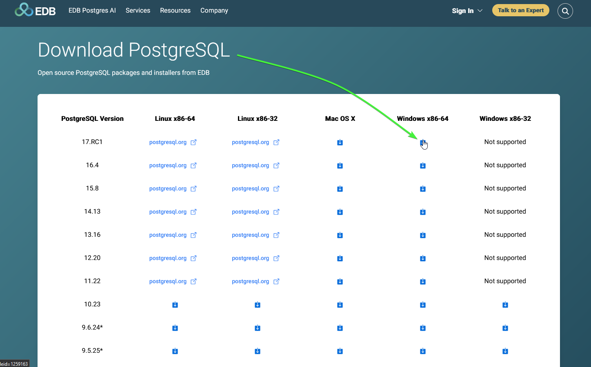</a>

#### Spustit instalaci

Po dokončení stahování dvakrát klikněte na stažený soubor a spusťte instalaci:

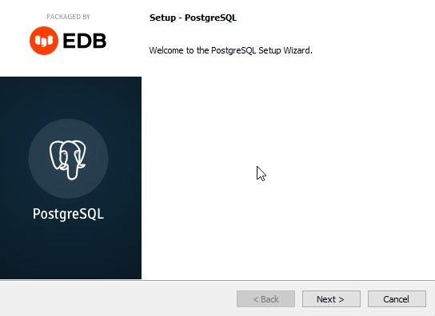

#### Složka pro instalaci

Můžete zadat umístění PostgreSQL,  vybereme prozatím výchozí volbu:

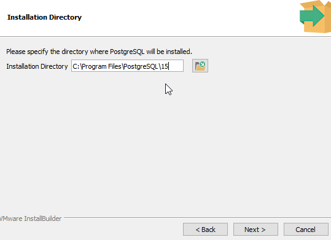

#### Výběr komponent

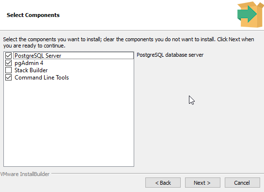

> [!NOTE]
> Chcete-li používat PostgreSQL, budete muset nainstalovat PostgreSQL Server.
>
> Doporučuji `pgAdmin 4`, který poskytuje uživatelské rozhraní a `Comand Line Tools` pro příkazový řádek.

#### Složka pro uložení dat databáze

Vyberte kam uložit data databáze, použijeme výchozí volbu:

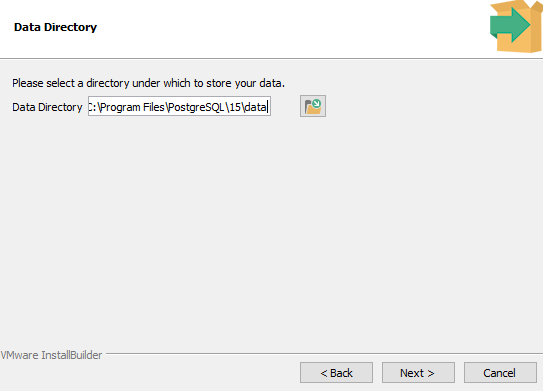

#### Nastavit heslo

Pro přístup do databáze budete muset zvolit heslo. 

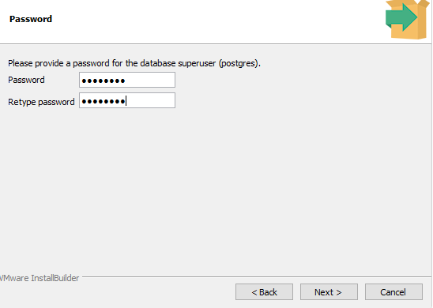

#### Port k naslouchání

Můžete nastavit port, na kterém má server naslouchat, použijeme výchozí volbu:

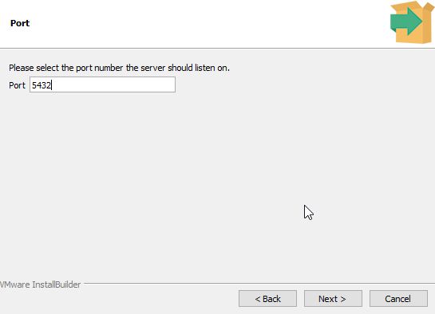


#### Geografické umístění serveru

Vyberte geografické umístění databázového serveru:

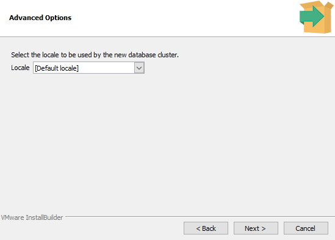

#### Kontrola před provedením

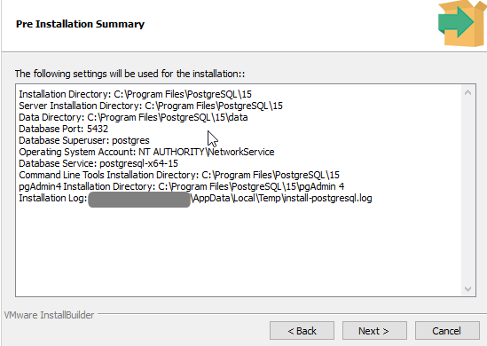

Následně stačí dokončit instalaci

### Příkazový řádek

#### Otestovat zda PostgreSQL naslouchá

Otevřít:

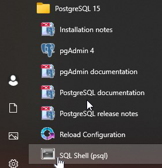

Připojení:

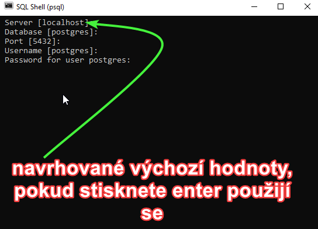


Nyní byste měli dostat výsledek podobný níže:

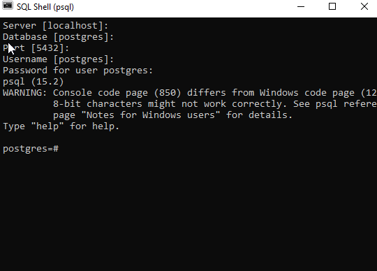

> [!WARNING]
> **Pokud nevidíte konzoli v angličtině**, musíte udělat tyto změny:
> 
> - Nastavit v `C:\Program Files\PostgreSQL\16\data\postgresql.conf`
>
> 	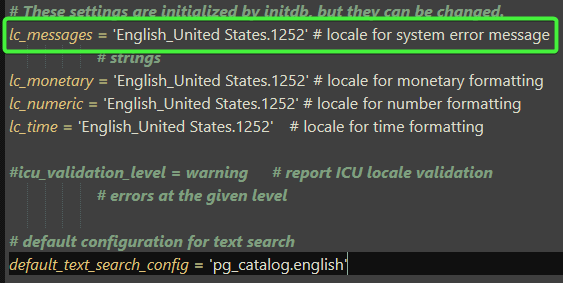
>
> - Nastavit v proměnném prostředí
>
> 	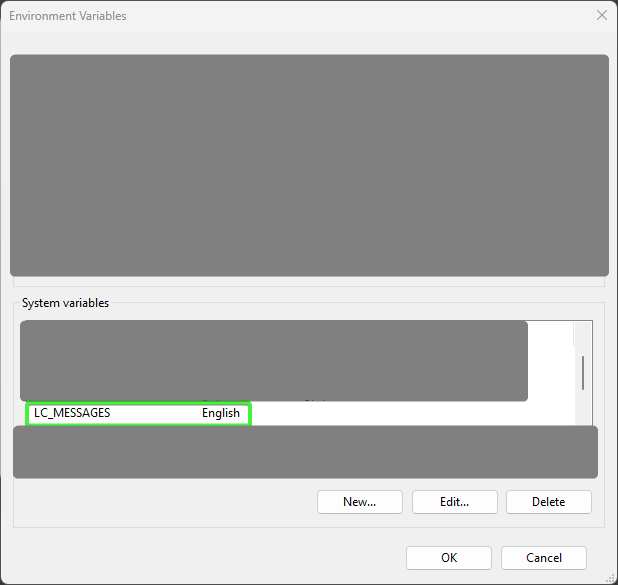
>
> Nyní stačí vypnout a zapnout konzoli a změny by se měli projevit


Pro odzkoušení zda jsme se správně připojili stačí zavolat kód níže:

```sql
SELECT version();
```

### Uživatelské rozhraní

Otevřete aplikaci:

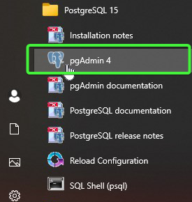