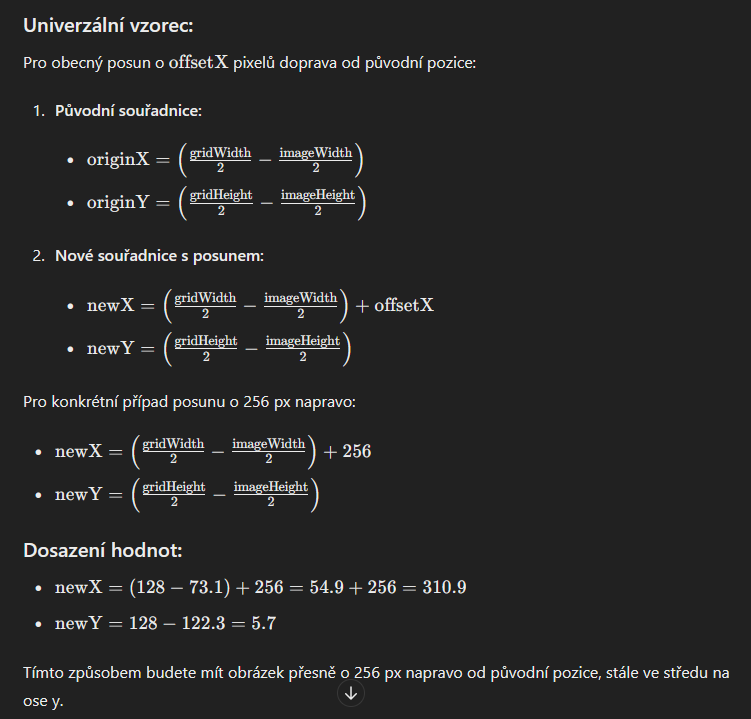
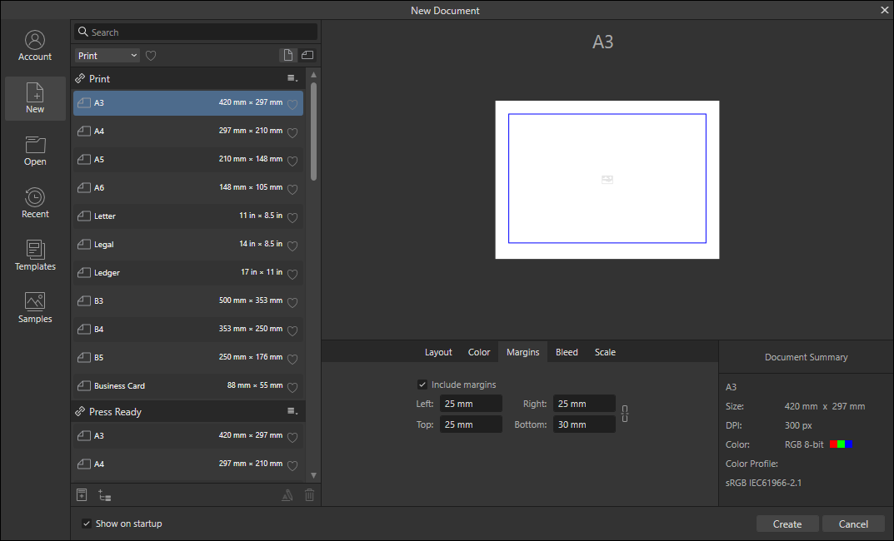
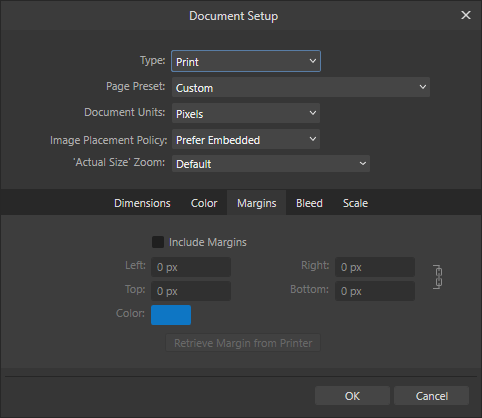

## Použití mřížky (grid)

<ol>
<li>View -> Show Grid (zobrazí mřížku)</li>
<li>View -> Grid and Axis... (nastavení mřížky)</li>
</ol>

### Výpočet obrázku pro zarovnání na střed

> [!NOTE]
> Ukázka níže používá tyto hodnoty:
>
>gridWidth = 256 px
>
>gridHeight = 256 px
>
> offsetX (posune obrázek do prava od původního) = 256 px

## FAQ

### Modrý čtverec uvnitř stránky

Je způsoben odsazením. (Include margins)

Řešení:

- Při vytváření nového dokumentu:

  

- Pro otevřený dokument:

  