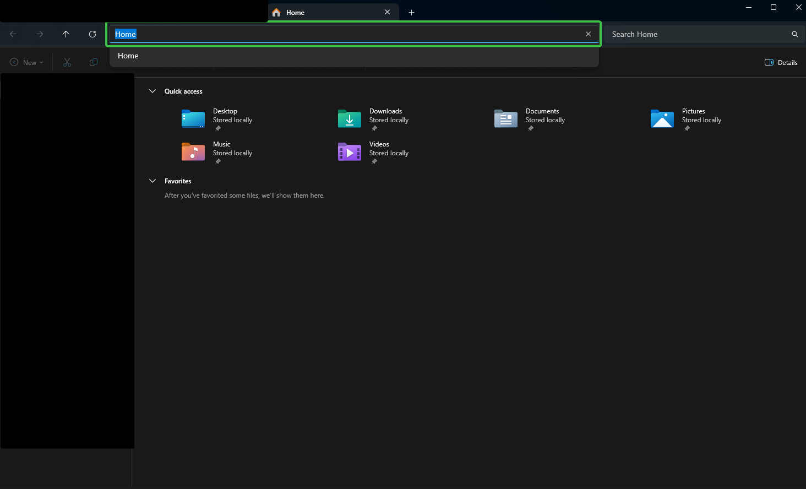

## Klávesnicové zkratky

### Minimalizace/Maximalizace všech oken

`Win` + `D`

### Skočení na adresní řádek

`Alt` + `D`

## Chybějící klávesy na klávesnici

### Kontextová klávesa

Řešení: 

`Shift` + `F10`