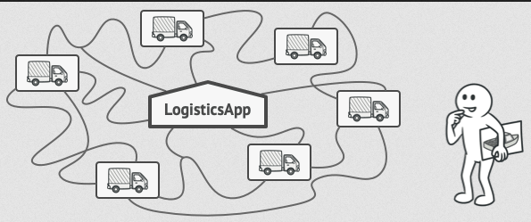
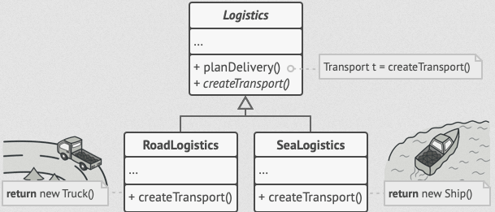
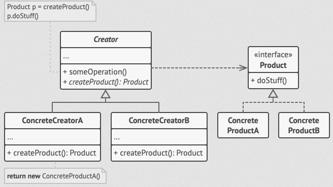

## Návrhové vzory

Vzory pro vytváření objektů

<details>
<summary><span style="color:#1E90FF;">Factory Method</span></summary>

Factory Method (Tovární metoda) je návrhový vzor pro tvorbu objektů, který poskytuje rozhraní pro vytváření objektů v
nadřazené třídě, ale umožňuje podtřídám upravit typ objektů, které budou vytvořeny.

- Problém:

  Představte si, že vytváříte aplikaci pro správu logistiky.

  První verze této aplikace zvládá pouze dopravu nákladními auty, takže většina kódu je v třídě `Truck`.

  Po čase se vaše aplikace stane populární. Denně dostáváte desítky požadavků od společností zabývajících se námořní
  dopravou, aby aplikace podporovala i námořní logistiku.

  

  > [!NOTE]
  > Přidání nové třídy do programu není jednoduché, pokud je zbytek kódu pevně svázán s existujícími třídami.

- Řešení:

  Vzor `Factory Method` navrhuje nahradit přímé volání konstruktorů (pomocí operátoru `new`) voláním speciální **tovární metody**. 

  > [!NOTE]
  > Nemusíte se obávat: objekty se stále vytvářejí pomocí operátoru `new`, ale tento operátor je volán z tovární metody. 
  > 
  > Objekty vrácené tovární metodou se často nazývají **produkty**.


  

  To umožňí možnost přepsat tovární metodu v podtřídě a změnit třídu produktů, které metoda vytváří

- Struktura:

  

  1. Produkt (`Product`): Definuje rozhraní pro objekty, které továrna vytváří.
  2. Konkrétní produkt (`ConcreteProduct`): Implementuje rozhraní produktu.
  3. Továrna (`Creator`): Deklaruje tovární metodu, která vrací objekty typu `Product`.
  4. Konkrétní továrna (`ConcreteCreator`): Přepisuje tovární metodu tak, aby vytvářela konkrétní produkty.

Tento vzor zajišťuje, že klientský kód (kód používající tovární metodu) nepozná rozdíl mezi produkty různých podtříd, protože pracuje pouze s abstraktními produkty.

Příklad

```csharp
//1. Product interface
public interface ITransport
{
    void Deliver();
}

//2. ConcreteProduct classes
public class Truck : ITransport
{
    public void Deliver()
    {
        Console.WriteLine("Deliver by land in a box.");
    }
}

public class Ship : ITransport
{
    public void Deliver()
    {
        Console.WriteLine("Deliver by sea in a container.");
    }
}

//3. Creator abstract class
public abstract class Logistics
{
    // Factory Method
    public abstract ITransport CreateTransport();

    public void PlanDelivery()
    {
        var transport = CreateTransport();
        transport.Deliver();
    }
}

//4. ConcreteCreator classes
public class RoadLogistics : Logistics
{
    public override ITransport CreateTransport()
    {
        return new Truck();
    }
}

public class SeaLogistics : Logistics
{
    public override ITransport CreateTransport()
    {
        return new Ship();
    }
}

//5. Client code
class Program
{
    static void Main(string[] args)
    {
        Logistics logistics;

        // Depending on the configuration or environment, we can choose the logistics type
        logistics = new RoadLogistics();
        logistics.PlanDelivery();

        logistics = new SeaLogistics();
        logistics.PlanDelivery();
    }
}
```
</details>