## Návrhové vzory

Vzory pro vytváření objektů

<details>
<summary><span style="color:#1E90FF;">Factory Method</span></summary>

> [!IMPORTANT]
> Zaměřuje se na **vytváření jednoho typu produktu**. (Má jednu tovární metodu, která je přepsána v podtřídách.)
>
> Používá se, když je potřeba vytvořit objekty, které mohou být různých typů, ale sdílejí společné rozhraní.

- Problém:

  Představte si, že vytváříte aplikaci pro správu logistiky.

  První verze této aplikace zvládá pouze dopravu nákladními auty, takže většina kódu je v třídě `Truck`.

  Po čase se vaše aplikace stane populární. Denně dostáváte desítky požadavků od společností zabývajících se námořní
  dopravou, aby aplikace podporovala i námořní logistiku.

  

  > [!NOTE]
  > Přidání nové třídy do programu není jednoduché, pokud je zbytek kódu pevně svázán s existujícími třídami.

- Řešení:

  Vzor `Factory Method` navrhuje nahradit přímé volání konstruktorů (pomocí operátoru `new`) voláním speciální **tovární
  metody**.

  > [!NOTE]
  > Nemusíte se obávat: objekty se stále vytvářejí pomocí operátoru `new`, ale tento operátor je volán z tovární metody.
  >
  > Objekty vrácené tovární metodou se často nazývají **produkty**.

  

To umožňí možnost přepsat tovární metodu v podtřídě a změnit třídu produktů, které metoda vytváří

- Struktura:

  

    1. Produkt (`Product`): Definuje rozhraní pro objekty, které továrna vytváří.
    2. Konkrétní produkt (`ConcreteProduct`): Implementuje rozhraní produktu.
    3. Továrna (`Creator`): Deklaruje tovární metodu, která vrací objekty typu `Product`.
    4. Konkrétní továrna (`ConcreteCreator`): Přepisuje tovární metodu tak, aby vytvářela konkrétní produkty.

Tento vzor zajišťuje, že klientský kód (kód používající tovární metodu) nepozná rozdíl mezi produkty různých podtříd,
protože pracuje pouze s abstraktními produkty.

Příklad

```csharp
//1. Product interface
public interface ITransport
{
    void Deliver();
}

//2. ConcreteProduct classes
public class Truck : ITransport
{
    public void Deliver()
    {
        Console.WriteLine("Deliver by land in a box.");
    }
}

public class Ship : ITransport
{
    public void Deliver()
    {
        Console.WriteLine("Deliver by sea in a container.");
    }
}

//3. Creator abstract class
public abstract class Logistics
{
    // Factory Method
    public abstract ITransport CreateTransport();

    public void PlanDelivery()
    {
        var transport = CreateTransport();
        transport.Deliver();
    }
}

//4. ConcreteCreator classes
public class RoadLogistics : Logistics
{
    public override ITransport CreateTransport()
    {
        return new Truck();
    }
}

public class SeaLogistics : Logistics
{
    public override ITransport CreateTransport()
    {
        return new Ship();
    }
}

//5. Client code
class Program
{
    static void Main(string[] args)
    {
        Logistics logistics;

        // Depending on the configuration or environment, we can choose the logistics type
        logistics = new RoadLogistics();
        logistics.PlanDelivery();

        logistics = new SeaLogistics();
        logistics.PlanDelivery();
    }
}
```

</details>

<details>
<summary><span style="color:#1E90FF;">Abstract Factory</span></summary>

> [!IMPORTANT]
> Zaměřuje se na **vytváření celé rodiny produktů, které spolu souvisejí**. (Má několik továrních metod, které jsou
> implementovány v konkrétních továrnách.)
>
> Používá se, když je potřeba vytvořit sadu souvisejících nebo závislých objektů, které musí být použity společně.

- Problém:

  Představte si, že vytváříte simulátor obchodu s nábytkem.

  Kód se skládá z tříd, které reprezentují:
    1. Produkty z rodiny, jako například `Chair`, `Sofa` a `CoffeeTable`.
    2. Různé varianty této rodiny, například produkty `Chair`, `Sofa` a `CoffeeTable` jsou dostupné ve variantách
       `Modern`, `Victorian`, `ArtDeco`.

        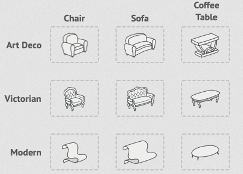

  Je třeba vytvořit jednotlivé kusy nábytku tak, aby odpovídaly ostatním objektům ve stejné rodině. (Zákazníci totiž
  neradi dostávají nesourodý nábytek.)

  

  Moderní pohovka se nehodí k viktoriánským židlím.

  > [!NOTE]
  > Nechcete měnit stávající kód pokaždé, když přidáte nové produkty nebo rodiny produktů.
  >
  > Prodejci nábytku často aktualizují své katalogy, takže změny v základním kódu by byly zbytečně náročné.

- Řešení:

    1. Deklarování rozhraní pro každý typ produktu v rámci rodiny (např. židle, pohovka, konferenční stolek).

       Všechny varianty produktů poté implementují tato rozhraní.

       Například všechny varianty židlí implementují rozhraní `Chair`, všechny konferenční stolky implementují rozhraní
       `CoffeeTable` atd.

       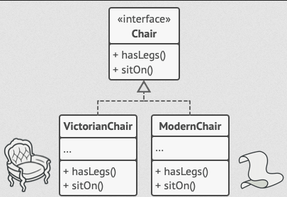

    2. Deklarovat `Abstract Factory` – rozhraní s metodami pro vytváření všech produktů v dané rodině (např.
       `createChair`, `createSofa`, `createCoffeeTable`).

       Tyto metody vrací `abstraktní` typy produktů, reprezentované výše zmíněnými rozhraními (`Chair`, `Sofa`,
       `CoffeeTable`).

       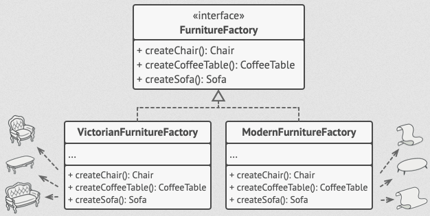

       Pro každou variantu produktů vytvoříte samostatnou tovární třídu, která vychází z rozhraní `AbstractFactory`.

       Například `ModernFurnitureFactory` vytvoří pouze produkty `ModernChair`, `ModernSofa` a `ModernCoffeeTable`.

  Klientský kód pracuje s továrnami i produkty výhradně prostřednictvím jejich abstraktních rozhraní.

  > [!NOTE]
  > To umožňuje měnit typ továrny a varianty produktů, které klientský kód obdrží, aniž by to klientský kód ovlivnilo.

- Struktura:

    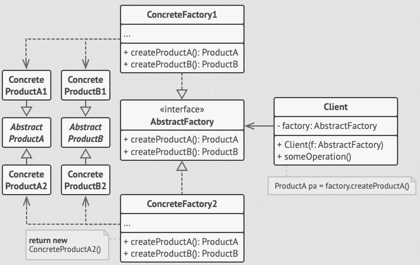

    1. Abstraktní produkty (`Abstract Products`)

       Rozhraní deklarující sadu příbuzných produktů tvořících jednu rodinu.

    2. Konkrétní produkty (`Concrete Products`)

       Implementace abstraktních produktů. Každý abstraktní produkt musí být implementován pro všechny varianty.
    3. Abstraktní továrna (`Abstract Factory`)

       Rozhraní deklarující metody pro vytváření produktů.
    4. Konkrétní továrny (`Concrete Factories`)

       Implementace abstraktní továrny.

       Každá konkrétní továrna odpovídá specifické variantě produktů.
    5. Klient (`Client`)

       Pracuje s produkty a továrnami prostřednictvím abstraktních rozhraní, což zajišťuje nezávislost na konkrétních
       implementacích.

Příklad:

```csharp
//1. Abstract Product interfaces
public interface IChair
{
    void SitOn();
}

public interface ISofa
{
    void LieOn();
}

public interface ICoffeeTable
{
    void PlaceItems();
}

//2. Concrete Product classes for Modern style
public class ModernChair : IChair
{
    public void SitOn()
    {
        Console.WriteLine("Sitting on a modern chair.");
    }
}

public class ModernSofa : ISofa
{
    public void LieOn()
    {
        Console.WriteLine("Lying on a modern sofa.");
    }
}

public class ModernCoffeeTable : ICoffeeTable
{
    public void PlaceItems()
    {
        Console.WriteLine("Placing items on a modern coffee table.");
    }
}

//2. Concrete Product classes for Victorian style
public class VictorianChair : IChair
{
    public void SitOn()
    {
        Console.WriteLine("Sitting on a Victorian chair.");
    }
}

public class VictorianSofa : ISofa
{
    public void LieOn()
    {
        Console.WriteLine("Lying on a Victorian sofa.");
    }
}

public class VictorianCoffeeTable : ICoffeeTable
{
    public void PlaceItems()
    {
        Console.WriteLine("Placing items on a Victorian coffee table.");
    }
}

//3. Abstract Factory interface
public interface IFurnitureFactory
{
    IChair CreateChair();
    ISofa CreateSofa();
    ICoffeeTable CreateCoffeeTable();
}

//4. Concrete Factory classes
public class ModernFurnitureFactory : IFurnitureFactory
{
    public IChair CreateChair()
    {
        return new ModernChair();
    }

    public ISofa CreateSofa()
    {
        return new ModernSofa();
    }

    public ICoffeeTable CreateCoffeeTable()
    {
        return new ModernCoffeeTable();
    }
}

public class VictorianFurnitureFactory : IFurnitureFactory
{
    public IChair CreateChair()
    {
        return new VictorianChair();
    }

    public ISofa CreateSofa()
    {
        return new VictorianSofa();
    }

    public ICoffeeTable CreateCoffeeTable()
    {
        return new VictorianCoffeeTable();
    }
}

//5. Client code
class Program
{
    static void Main(string[] args)
    {
        IFurnitureFactory factory;

        // Create modern furniture
        factory = new ModernFurnitureFactory();
        IChair modernChair = factory.CreateChair();
        ISofa modernSofa = factory.CreateSofa();
        ICoffeeTable modernTable = factory.CreateCoffeeTable();

        modernChair.SitOn();
        modernSofa.LieOn();
        modernTable.PlaceItems();

        // Create Victorian furniture
        factory = new VictorianFurnitureFactory();
        IChair victorianChair = factory.CreateChair();
        ISofa victorianSofa = factory.CreateSofa();
        ICoffeeTable victorianTable = factory.CreateCoffeeTable();

        victorianChair.SitOn();
        victorianSofa.LieOn();
        victorianTable.PlaceItems();
    }
}
```

</details>

<details>
<summary><span style="color:#1E90FF;">Builder</span></summary>

> [!IMPORTANT]
> Zaměřuje se na **konstrukci složitých objektů krok za krokem**. (Má několik metod pro konstrukci objektu, které mohou
> být volány v různém pořadí.)
>
> Používá se, když je potřeba vytvořit objekt, který se skládá z mnoha součástí, ale jeho vytváření je stejné pro
> všechny součásti.

- Problém:

  Představte si složitý objekt, který vyžaduje zdlouhavou a postupnou inicializaci mnoha polí a vnořených objektů.

  Takový inicializační kód bývá obvykle ukryt v obřím konstruktoru s mnoha parametry, nebo i hůře a to roztříštěn po
  celém klientském kódu.

    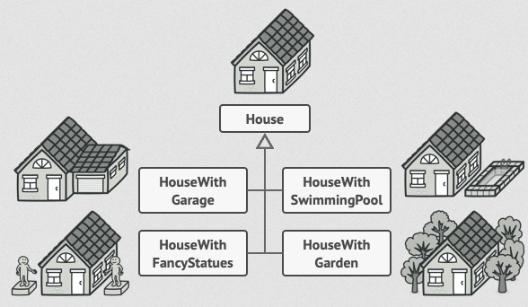

  Mohli byste program příliš zkomplikovat tím, že byste vytvořili podtřídu pro každou možnou konfiguraci objektu.

  Například, uvažujme, jak vytvořit objekt `House`.

    - Pro stavbu jednoduchého domu potřebujete postavit čtyři zdi a podlahu, nainstalovat dveře, osadit okna a postavit
      střechu. Ale co když chcete větší, světlejší dům se zahradou a dalšími vychytávkami (jako je topný systém, vodovod
      a elektroinstalace)?

      Nejjednodušším řešením je rozšířit základní třídu `House` a vytvořit sadu podtříd pokrývajících všechny kombinace
      parametrů. (Nakonec ale skončíte s obrovským množstvím podtříd.)

      Každý nový parametr, jako například styl verandy, si vyžádá další růst této hierarchie.

      Existuje jiný přístup, který nevyžaduje množení podtříd.

    - Můžete vytvořit obří konstruktor přímo v základní třídě `House` s veškerými možnými parametry, které objekt domu
      ovládají. (Tento přístup sice eliminuje potřebu podtříd, ale vytváří jiný problém.)

        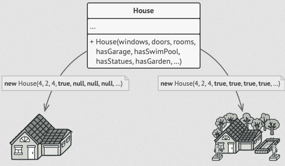

      Konstruktor s mnoha parametry má své nevýhody a to, že ne všechny parametry jsou vždy potřebné.

      Ve většině případů bude většina parametrů nepoužitá, což činí kód těžko čitelným a udržovatelným. (Například jen
      zlomek domů má bazény, takže parametry týkající se bazénů budou devětkrát z deseti zbytečné.)

- Řešení:

  Vzor Builder navrhuje přesunout kód konstrukce objektů z jejich vlastní třídy do samostatných objektů nazývaných
  `builders`.

    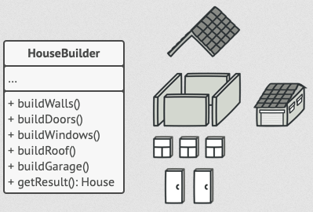

  Tento vzor umožňuje konstruovat složité objekty krok za krokem.

  Nedovoluje ostatním objektům přístup k produktu během jeho konstrukce.

  Vzor organizuje konstrukci objektu do sady kroků (`buildWalls`, `buildDoor` atd.).

  Pro vytvoření objektu spustíte na objektu builder sérii těchto kroků.

  Důležitou částí je, že nemusíte volat všechny kroky. (Můžete zavolat jen ty kroky, které jsou potřebné pro vytvoření
  konkrétní konfigurace objektu.)

  Některé kroky konstrukce mohou vyžadovat různé implementace, když potřebujete vytvořit různé reprezentace produktu. (
  Například stěny chaty mohou být postaveny ze dřeva, zatímco stěny hradu musí být postaveny z kamene.)

  V tomto případě můžete vytvořit několik různých tříd builderů, které implementují stejnou sadu kroků, ale různými
  způsoby. Poté můžete tyto buildery použít v procesu konstrukce (tj. v nařízené sadě volání konstrukčních kroků) k
  vytvoření různých druhů objektů.

    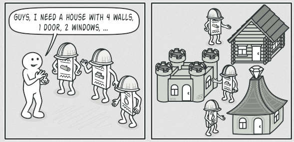

  Například si představte builder, který staví vše ze dřeva a skla, druhý, který staví vše z kamene a železa, a třetí,
  který používá zlato a diamanty.

  Zavoláním stejné sady kroků získáte běžný dům od prvního builderu, malý hrad od druhého a palác od třetího.

  To by však fungovalo pouze v případě, že klientský kód, který volá stavební kroky, dokáže komunikovat s buildery
  pomocí společného rozhraní.

    <hr>

  Director

  Můžete jít dál a přesunout sérii volání kroků builderu, které používáte k vytvoření produktu, do samostatné třídy
  nazývané `director`.

  Třída director definuje pořadí, ve kterém se provádějí stavební kroky, zatímco builder poskytuje implementaci těchto
  kroků.

  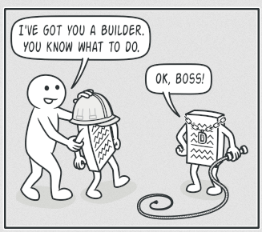

  Director zná, jaké kroky provést, aby vznikl funkční produkt.

  Použití třídy director není nezbytné. (Kroky konstrukce můžete vždy volat v určitém pořadí přímo z klientského kódu.)
  Třída director však může být vhodným místem pro uložení různých konstrukčních rutin, abyste je mohli znovu použít v
  celém programu.

  Navíc třída director zcela skrývá detaily konstrukce produktu před klientským kódem. (Klient potřebuje pouze přiřadit
  builder k directorovi, spustit konstrukci přes director a získat výsledek od builderu.)

- Struktura

    1. Rozhraní Builder deklaruje kroky konstrukce produktu, které jsou společné pro všechny typy builderů.

    2. Konkrétní buildeři poskytují různé implementace konstrukčních kroků. (Konkrétní buildeři mohou produkovat
       produkty, které nemusí dodržovat společné rozhraní.)

    3. Produkty jsou výsledné objekty. (Produkty vytvořené různými buildry nemusí patřit do stejné hierarchie tříd nebo
       rozhraní.)

    4. Třída Director definuje pořadí, ve kterém se volají konstrukční kroky, takže můžete vytvářet a znovu používat
       specifické konfigurace produktů.

    5. Klient musí přiřadit jeden z builder objektů k directorovi.

       Obvykle se to dělá jen jednou, prostřednictvím parametrů konstruktoru directora.

       Poté director používá tento builder objekt pro veškerou další konstrukci.

       Existuje však alternativní přístup, kdy klient předává builder objekt metodě produkce directora. (V tomto případě
       můžete použít jiný builder pokaždé, když
       něco produkujete s directorem.)

Příklad:

```csharp
// Rozhraní pro produkt
public interface IHouse
{
    void Show();
}

// Konkrétní produkt - Dřevěný dům
public class WoodenHouse : IHouse
{
    public void Show()
    {
        Console.WriteLine("Dřevěný dům postaven.");
    }
}

// Konkrétní produkt - Kamenný dům
public class StoneHouse : IHouse
{
    public void Show()
    {
        Console.WriteLine("Kamenný dům postaven.");
    }
}

// Rozhraní pro builder
public interface IHouseBuilder
{
    void BuildWalls();
    void BuildDoors();
    void BuildWindows();
    void BuildRoof();
    IHouse GetHouse();
}

// Konkrétní builder - Dřevěný dům
public class WoodenHouseBuilder : IHouseBuilder
{
    private WoodenHouse house = new WoodenHouse();

    public void BuildWalls()
    {
        Console.WriteLine("Stavba dřevěných zdí.");
    }

    public void BuildDoors()
    {
        Console.WriteLine("Instalace dřevěných dveří.");
    }

    public void BuildWindows()
    {
        Console.WriteLine("Instalace dřevěných oken.");
    }

    public void BuildRoof()
    {
        Console.WriteLine("Stavba dřevěné střechy.");
    }

    public IHouse GetHouse()
    {
        return house;
    }
}

// Konkrétní builder - Kamenný dům
public class StoneHouseBuilder : IHouseBuilder
{
    private StoneHouse house = new StoneHouse();

    public void BuildWalls()
    {
        Console.WriteLine("Stavba kamenných zdí.");
    }

    public void BuildDoors()
    {
        Console.WriteLine("Instalace kamenných dveří.");
    }

    public void BuildWindows()
    {
        Console.WriteLine("Instalace kamenných oken.");
    }

    public void BuildRoof()
    {
        Console.WriteLine("Stavba kamenné střechy.");
    }

    public IHouse GetHouse()
    {
        return house;
    }
}

// Director třída
public class HouseDirector
{
    private IHouseBuilder builder;

    public HouseDirector(IHouseBuilder builder)
    {
        this.builder = builder;
    }

    public void ConstructHouse()
    {
        builder.BuildWalls();
        builder.BuildDoors();
        builder.BuildWindows();
        builder.BuildRoof();
    }
}

// Klientský kód
class Program
{
    static void Main(string[] args)
    {
        // Vytvoření dřevěného domu
        IHouseBuilder woodenBuilder = new WoodenHouseBuilder();
        HouseDirector director = new HouseDirector(woodenBuilder);
        director.ConstructHouse();
        IHouse woodenHouse = woodenBuilder.GetHouse();
        woodenHouse.Show();
        
        // Vytvoření kamenného domu
        IHouseBuilder stoneBuilder = new StoneHouseBuilder();
        director = new HouseDirector(stoneBuilder);
        director.ConstructHouse();
        IHouse stoneHouse = stoneBuilder.GetHouse();
        stoneHouse.Show();
        
        // Vytvoření dřevěného domu bez použití Directora
        IHouseBuilder woodenBuilder = new WoodenHouseBuilder();
        woodenBuilder.BuildWalls();
        woodenBuilder.BuildDoors();
        woodenBuilder.BuildWindows();
        woodenBuilder.BuildRoof();
        IHouse woodenHouse = woodenBuilder.GetHouse();
        woodenHouse.Show();
    }
}
```

</details>

<details>
<summary><span style="color:#1E90FF;">Prototype</span></summary>

> [!IMPORTANT]
> Zaměřuje se na **vytváření objektů pomocí kopírování existujících objektů**. (Má metodu `clone`, která vytváří kopii
> objektu.)
>
> Používá se, když je potřeba vytvořit objekt, který je podobný existujícímu objektu, ale s některými změnami.

- Problém

  Představte si, že máte objekt a chcete vytvořit jeho přesnou kopii.

  Jak byste to udělali? Nejprve musíte vytvořit nový objekt stejné třídy. Poté musíte projít všechna pole původního
  objektu a zkopírovat jejich hodnoty do nového objektu.

  Super! Ale je tu háček. Ne všechny objekty lze takto kopírovat, protože některá jejich pole mohou být soukromá a
  nedostupná zvenčí.

  

  Kopírování objektu „z vnějšku“ není vždy možné.

  Dalším problémem přímého přístupu je to, že musíte znát třídu objektu, abyste vytvořili jeho duplikát, čímž váš kód
  závisí na této třídě.

  Pokud vás další závislost neděsí, je tu ještě jedna potíž. Někdy znáte pouze rozhraní, kterému objekt odpovídá,
  nikoliv jeho konkrétní třídu. Například když metoda přijímá parametry, které splňují určité rozhraní.


- Řešení

  Vzor `prototyp` deleguje proces klonování na samotné objekty, které mají být klonovány.

  Tento vzor definuje společné rozhraní pro všechny objekty podporující klonování. (Toto rozhraní umožňuje klonovat
  objekt, aniž byste museli spojovat váš kód s třídou tohoto objektu.)

  Obvykle toto rozhraní obsahuje pouze jednu metodu `clone`.

  Implementace metody `clone` je velmi podobná ve všech třídách. (Metoda vytvoří objekt aktuální třídy a přenese všechny
  hodnoty polí starého objektu do nového.)

  > [!NOTE]
  > Můžete dokonce kopírovat soukromá pole, protože většina programovacích jazyků umožňuje objektům přistupovat k
  soukromým polím jiných objektů patřících ke stejné třídě.

  Objekt, který podporuje klonování, se nazývá `prototyp`. (Pokud mají vaše objekty desítky polí a stovky možných
  konfigurací, může jejich klonování sloužit jako alternativa k podtřídám.)

  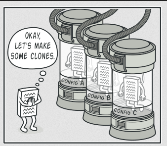

    - Struktura

        1. Rozhraní prototypu

           Deklaruje metodu klonování.

        2. Konkrétní prototyp

           Implementuje metodu klonování.

           Kromě kopírování dat původního objektu do klonu může tato metoda řešit i některé okrajové případy spojené s
           klonováním, jako je klonování propojených objektů, rozplétání
           rekurzivních závislostí atd.

        3. Klient

           Může vytvořit kopii libovolného objektu, který implementuje rozhraní prototypu.

Příklad:

```csharp
// Rozhraní pro prototyp
public interface IPrototype
{
    IPrototype Clone();
}

// Konkrétní prototyp - Kniha
public class Book : IPrototype
{
    public string Title { get; set; }
    public string Author { get; set; }

    public Book(string title, string author)
    {
        Title = title;
        Author = author;
    }

    // Metoda klonování
    public IPrototype Clone()
    {
        return new Book(Title, Author);
    }

    public void ShowDetails()
    {
        Console.WriteLine($"Kniha: {Title}, Autor: {Author}");
    }
}

// Klientský kód
class Program
{
    static void Main(string[] args)
    {
        // Původní objekt
        Book originalBook = new Book("1984", "George Orwell");
        originalBook.ShowDetails();

        // Klonovaný objekt
        Book clonedBook = (Book)originalBook.Clone();
        clonedBook.ShowDetails();
    }
}
```

</details>

<details>
<summary><span style="color:#1E90FF;">Singleton</span></summary>

> [!IMPORTANT]
> Zaměřuje se na **zajištění, že třída má pouze jednu instanci** a poskytuje globální přístup k ní.
>
> Používá se, když je potřeba, aby v systému existovala pouze jedna instance třídy, která je sdílena všemi ostatními

- Problém

  Vzor Singleton řeší dva problémy zároveň a porušuje `Princip jediné odpovědnosti`:

    1. Zajistit, že třída má pouze jednu instanci.

       Proč by někdo chtěl kontrolovat, kolik instancí třída má? Nejčastější důvod je kontrola přístupu k nějakému
       sdílenému zdroji, například databázi nebo souboru.

       Představte si, že jste vytvořili objekt, ale po chvíli jste se rozhodli vytvořit nový.

       Místo toho, abyste obdrželi nový objekt, dostanete ten, který jste již vytvořili.  (Tento způsob chování nelze
       implementovat běžným konstruktorem, protože volání konstruktoru musí vždy vrátit nový objekt podle návrhu.)

       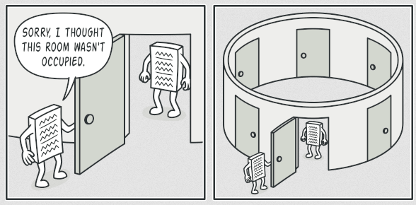

       Klienti si nemusí ani uvědomit, že pracují stále s tím samým objektem.

    2. Poskytnout globální přístupový bod k této instanci

       Stejně jako globální proměnná, i Singleton vzor vám umožňuje přistupovat k objektu z jakéhokoli místa v
       programu. (Nicméně chrání tuto instanci před přepsáním jiným kódem.)


- Řešení

  Všechny implementace Singleton mají dva společné kroky:

  - Udělejte výchozí konstruktor soukromý, aby zabránil jiným objektům používat operátor `new` s třídou Singleton.

  - Vytvořte statickou metodu pro tvorbu objektu, která slouží jako konstruktor.

    Tato metoda volá soukromý konstruktor pro vytvoření objektu a uloží ho do statického pole.

    Všechny následující volání této metody vrací tento uložený objekt.

Příklad:

```csharp
// Singleton třída
public class Singleton
{
    // Statická proměnná pro uložení jediné instance třídy
    private static Singleton instance;

    // Soukromý konstruktor, aby se zabránilo vytváření instancí zvenčí
    private Singleton() { }

    // Statická metoda pro získání jediné instance třídy
    public static Singleton GetInstance()
    {
        if (instance == null)
        {
            instance = new Singleton();
        }
        return instance;
    }

    // Příklad metody třídy Singleton
    public void ShowMessage()
    {
        Console.WriteLine("Toto je Singleton instance.");
    }
}

// Klientský kód
class Program
{
    static void Main(string[] args)
    {
        // Získání jediné instance třídy Singleton
        Singleton singleton = Singleton.GetInstance();
        singleton.ShowMessage();

        // Pokus o vytvoření další instance vrátí stejnou instanci
        Singleton anotherSingleton = Singleton.GetInstance();
        anotherSingleton.ShowMessage();

        // Ověření, že obě instance jsou stejné
        Console.WriteLine(object.ReferenceEquals(singleton, anotherSingleton)); // Výstup: True
    }
}
```
</details>

---

Vzory pro skturury tříd

<details>
<summary><span style="color:#1E90FF;">Adapter (Wrapper)</span></summary>

> [!IMPORTANT]
> Zaměřuje se na **přizpůsobení rozhraní existující třídy tak, aby vyhovovalo potřebám jiné třídy**.
> 
> Používá se, když je potřeba propojit dvě třídy, které nemají kompatibilní rozhraní.

- Problém

    Představte si, že vytváříte aplikaci pro sledování akciového trhu. 

    Aplikace stahuje data o akciích z různých zdrojů ve formátu XML a poté zobrazuje uživatelsky příjemné grafy a diagramy.

    V určitém okamžiku se rozhodnete vylepšit aplikaci integrací chytré analytické knihovny třetí strany. Ale je tu háček: analytická knihovna funguje pouze s daty ve formátu JSON.

    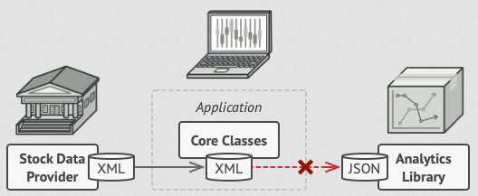

    Nemůžete použít analytickou knihovnu "tak jak je", protože očekává data v formátu, který je nekompatibilní s vaší aplikací.

    Můžete změnit knihovnu, aby pracovala s XML. (To by však mohlo zničit některý existující kód, který na knihovnu spoléhá, nebo možná nemáte přístup k původnímu kódu knihovny, což tuto možnost činí nemožnou.)


- Řešení

    Můžete vytvořit `adapter`. 

    To je speciální objekt, který převádí rozhraní jednoho objektu tak, aby ho druhý objekt mohl pochopit.

    Adapter zabalí jeden z objektů a skryje složitost převodu, který se děje v pozadí. (Zabalený objekt si ani neuvědomuje adapter.) 

    Například můžete zabalit objekt, který pracuje v metrech a kilometrech, do adapteru, který převádí všechna data na imperiální jednotky, jako jsou stopy a míle.

    Adaptéry mohou nejen převádět data do různých formátů, ale mohou také pomoci objektům s různými rozhraními spolupracovat. 

    Jak to funguje:

    1. Adapter získá rozhraní kompatibilní s jedním z existujících objektů.
    2. Pomocí tohoto rozhraní může existující objekt bezpečně volat metody adapteru.
    3. Po obdržení požadavku adapter předá žádost druhému objektu, ale ve formátu a pořadí, které druhý objekt očekává.

    Někdy je dokonce možné vytvořit obousměrný adapter, který může převádět volání v obou směrech.

    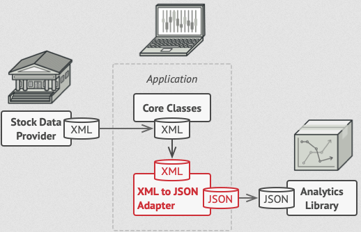

    Vraťme se zpět k naší aplikaci pro akciový trh. 

    Abychom vyřešili dilema nekompatibilních formátů, můžeme vytvořit XML-to-JSON adaptéry pro každou třídu analytické knihovny, se kterou náš kód přímo pracuje. 

    Poté upravíme náš kód, aby komunikoval s knihovnou pouze prostřednictvím těchto adaptérů. 

    Když adapter obdrží požadavek, přeloží příchozí XML data do JSON struktury a předá požadavek na příslušné metody zabaleného analytického objektu.

- Struktura

    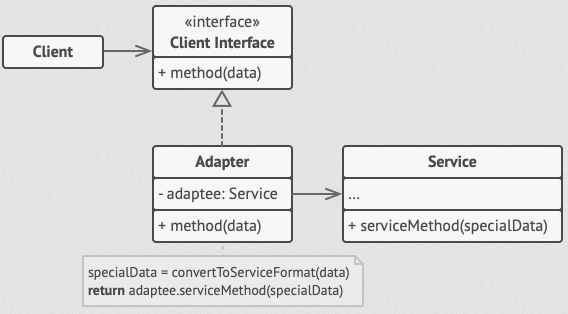

1. Client

    Třída, která obsahuje existující obchodní logiku programu.
2. Client Interface
 
    Popisuje protokol, který musí ostatní třídy dodržovat, aby mohly spolupracovat s klientským kódem.
3. Service

    Je užitečná třída (obvykle třetí strany nebo legacy), kterou klient nemůže použít přímo, protože má nekompatibilní rozhraní.
4. Adapter

    Třída, která je schopná pracovat s klientem i službou: implementuje klientské rozhraní, zatímco obaluje objekt služby. 

    Adapter přijímá volání od klienta prostřednictvím klientského rozhraní a převádí je na volání zabaleného objektu služby v formátu, který služba chápe.
5. Klientský kód není spojen s konkrétní třídou adapteru, pokud pracuje s adapterem prostřednictvím klientského rozhraní. 

    Díky tomu můžete do programu přidávat nové typy adapterů, aniž byste rozbili existující klientský kód. 

    > [!NOTE]
    > To může být užitečné, když se změní nebo nahradí rozhraní třídy služby, jelikož stačí vytvořit novou třídu adapteru, aniž byste museli měnit klientský kód.

Příklad:

```csharp
// Rozhraní klienta, které očekává data ve formátu JSON
public interface IJsonData
{
    string GetJsonData();
}

// Třída služby, která poskytuje data ve formátu XML
public class XmlDataService
{
    public string GetXmlData()
    {
        return "<data><item>Hodnota</item></data>";
    }
}

// Adapter, který převádí XML data na JSON data
public class XmlToJsonAdapter : IJsonData
{
    private readonly XmlDataService _xmlDataService;

    public XmlToJsonAdapter(XmlDataService xmlDataService)
    {
        _xmlDataService = xmlDataService;
    }

    public string GetJsonData()
    {
        // Získání XML dat ze služby
        string xmlData = _xmlDataService.GetXmlData();

        // Převod XML na JSON (zde je to zjednodušeno)
        string jsonData = "{\"data\": {\"item\": \"Hodnota\"}}";

        return jsonData;
    }
}

// Klientský kód, který pracuje s daty ve formátu JSON
public class Client
{
    private readonly IJsonData _jsonData;

    public Client(IJsonData jsonData)
    {
        _jsonData = jsonData;
    }

    public void DisplayData()
    {
        string data = _jsonData.GetJsonData();
        Console.WriteLine("Data ve formátu JSON: " + data);
    }
}

// Hlavní program
class Program
{
    static void Main(string[] args)
    {
        // Vytvoření instance služby, která poskytuje XML data
        XmlDataService xmlDataService = new XmlDataService();

        // Vytvoření adapteru, který převádí XML data na JSON data
        IJsonData jsonData = new XmlToJsonAdapter(xmlDataService);

        // Vytvoření klienta, který pracuje s JSON daty
        Client client = new Client(jsonData);

        // Zobrazení dat ve formátu JSON
        client.DisplayData();
    }
}
```
</details>

<details>
<summary><span style="color:#1E90FF;">Bridge</span></summary>

> [!IMPORTANT]
> Zaměřuje se na **rozložení velké třídy nebo několika tříd do dvou samostatných hierarchií** - abstrakce a implementace - které mohou být vyvíjeny nezávisle na sobě.
> 
> Používá se, když je potřeba, aby se abstrakce a implementace mohly vyvíjet nezávisle na sobě.

- Problém

    Řekněme, že máte geometrií `Shape` třídu se dvěma podtřídami: `Circle` a `Square`. 

    Chcete tuto hierarchii tříd rozšířit o barvy, takže plánujete vytvořit podtřídy `Red` a `Blue` pro tvary. 

    Avšak, protože už máte dvě podtřídy, budete muset vytvořit čtyři kombinace tříd, jako například `BlueCircle` a `RedSquare`.

    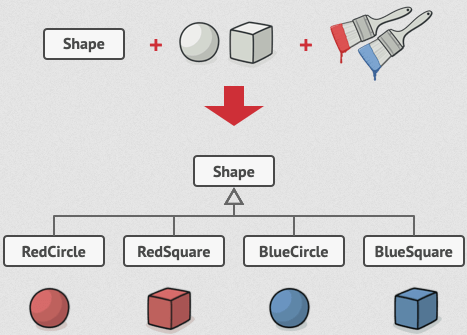

    Počet kombinací tříd roste v geometrické progresi.

- Řešení

    Vzor Bridge se tento problém snaží vyřešit přechodem od dědičnosti k objektové kompozici.

    To znamená, že extrahujete jednu z dimenzí do samostatné hierarchie tříd, takže původní třídy budou odkazovat na objekt z nové hierarchie, místo aby měly celý svůj stav a chování v jedné třídě.

    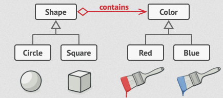

    Můžete zabránit explozí hierarchie tříd tím, že ji přeměníte na několik souvisejících hierarchií.

Příklad:

```csharp
// Rozhraní implementace
public interface IColor
{
    void ApplyColor();
}

// Konkrétní implementace - Červená barva
public class RedColor : IColor
{
    public void ApplyColor()
    {
        Console.WriteLine("Aplikování červené barvy.");
    }
}

// Konkrétní implementace - Modrá barva
public class BlueColor : IColor
{
    public void ApplyColor()
    {
        Console.WriteLine("Aplikování modré barvy.");
    }
}

// Abstrakce
public abstract class Shape
{
    protected IColor color;

    protected Shape(IColor color)
    {
        this.color = color;
    }

    public abstract void Draw();
}

// Rozšířená abstrakce - Kruh
public class Circle : Shape
{
    public Circle(IColor color) : base(color) { }

    public override void Draw()
    {
        Console.Write("Kreslení kruhu s barvou: ");
        color.ApplyColor();
    }
}

// Rozšířená abstrakce - Čtverec
public class Square : Shape
{
    public Square(IColor color) : base(color) { }

    public override void Draw()
    {
        Console.Write("Kreslení čtverce s barvou: ");
        color.ApplyColor();
    }
}

// Klientský kód
class Program
{
    static void Main(string[] args)
    {
        // Vytvoření červeného kruhu
        Shape redCircle = new Circle(new RedColor());
        redCircle.Draw();

        // Vytvoření modrého čtverce
        Shape blueSquare = new Square(new BlueColor());
        blueSquare.Draw();
    }
}
```
</details>

<details>
<summary><span style="color:#1E90FF;">Composite</span></summary>

> [!IMPORTANT]
> Zaměřuje se na **seskupení objektů do stromové struktury, aby bylo možné pracovat s jednotlivými objekty i skupinami objektů stejným způsobem**.
> 
> Používá se, když je potřeba pracovat s objekty a skupinami objektů stejným způsobem.

- Problém

    Má smysl pouze tehdy, když jádrový model vaší aplikace lze reprezentovat jako strom.

    Například si představte, že máte dva typy objektů: `Produkty` a `Krabice`. 

    - `Krabice` může obsahovat několik `Produktů` a také několik menších `Krabic`. 
    - Tyto malé `Krabice` mohou také obsahovat některé `Produkty` nebo ještě menší `Krabice` a tak dále.

    Řekněme, že se rozhodnete vytvořit objednávkový systém, který používá tyto třídy. 

    Objednávky mohou obsahovat jednoduché produkty bez jakéhokoliv balení, stejně jako krabice plné produktů... a dalších krabic. Jak byste určili celkovou cenu takové objednávky?

    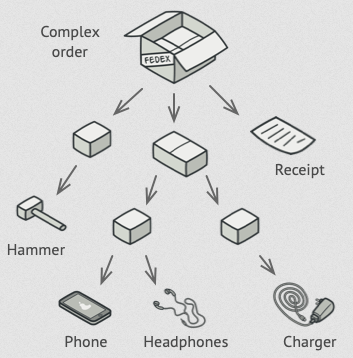

    Objednávka může zahrnovat různé produkty, zabalené v krabicích, které jsou zabalené v ještě větších krabicích a tak dále. (Celá struktura vypadá jako obrácený strom.)

    Můžete zkusit přímý přístup, tak že rozbalíte všechny krabice, projdete všechny produkty a pak spočítáte celkovou cenu. 

    To by bylo v reálném světě proveditelné, ale v programu to není tak jednoduché, jako provést smyčku. 

    Musíte znát třídy `Produktů` a `Krabic`, kterými procházíte, úroveň zanoření krabic a další detaily předem. 

    To vše činí přímý přístup buď příliš nepohodlným, nebo dokonce nemožným.

- Řešení

    Vzorec `Composite` navrhuje, abyste pracovali s `Produkty` a `Krabicemi` prostřednictvím společného rozhraní, které vyhlašuje metodu pro výpočet celkové ceny.

    Jak by tato metoda fungovala? U produktu by jednoduše vrátila cenu produktu. 

    - U krabice by prošla každý prvek, který obsahuje, zeptala se na jeho cenu a pak vrátila celkovou cenu této krabice. 
    - Pokud by některý z těchto prvků byla menší krabice, tato krabice by začala procházet svůj obsah a tak dále, dokud by nebyly vypočítány ceny všech vnitřních komponent.
    - Krabice by dokonce mohla přidat nějaké dodatečné náklady na konečnou cenu, například náklady na balení.

    

    Vzorec `Composite` umožňuje provádět chování rekurzivně na všech komponentách objektového stromu.

    Největší výhodou tohoto přístupu je, že se nemusíte starat o konkrétní třídy objektů, které tvoří strom. 

    Nemusíte vědět, zda je objekt jednoduchý produkt, nebo sofistikovaná krabice. 

    Všechny je můžete ošetřovat stejně prostřednictvím společného rozhraní. 

    Když zavoláte metodu, objekty samy předají požadavek dolů stromem.

- Struktura

    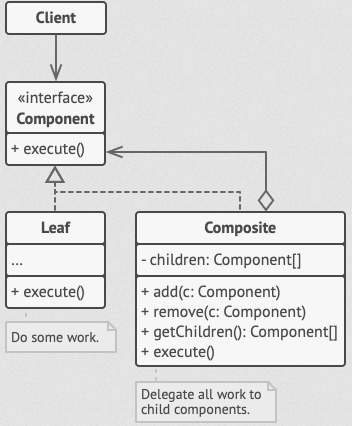

    1. Component

       Rozhraní popisuje operace, které jsou společné jak pro jednoduché, tak pro složité prvky stromu.

    2. Leaf

       Základní prvek stromu, který nemá pod-prvky.

       Obvykle právě listové komponenty vykonávají většinu skutečné práce, protože nemají nikoho, na koho by práci delegovaly.

    3. Container (nebo také `composite`)

       Prvek, který má pod-prvky: listy nebo jiné kontejnery.

       Kontejner nezná konkrétní třídy svých dětí. (Pracuje s pod-prvky pouze prostřednictvím komponentového rozhraní.)

       Po obdržení požadavku kontejner deleguje práci na své pod-prvky, zpracuje mezivýsledky a pak vrátí konečný výsledek klientovi.

    4. Client

       Pracuje se všemi prvky prostřednictvím komponentového rozhraní. (Díky tomu může klient pracovat stejně s jednoduchými i složitými prvky stromu.)

Příklad:

```csharp
// Rozhraní Component, které deklaruje operace společné pro jednoduché i složité prvky stromu
public interface IComponent
{
    void DisplayPrice();
}

// Třída Leaf, která reprezentuje základní prvek stromu bez pod-prvků
public class Product : IComponent
{
    private string name;
    private int price;

    public Product(string name, int price)
    {
        this.name = name;
        this.price = price;
    }

    public void DisplayPrice()
    {
        Console.WriteLine($"{name}: {price} Kč");
    }
}

// Třída Composite, která reprezentuje prvek stromu s pod-prvky
public class Box : IComponent
{
    private string name;
    private List<IComponent> components = new List<IComponent>();

    public Box(string name)
    {
        this.name = name;
    }

    public void AddComponent(IComponent component)
    {
        components.Add(component);
    }

    public void DisplayPrice()
    {
        Console.WriteLine($"{name} obsahuje:");
        foreach (var component in components)
        {
            component.DisplayPrice();
        }
    }
}

// Klientský kód
class Program
{
    static void Main(string[] args)
    {
        // Vytvoření produktů
        IComponent product1 = new Product("Produkt 1", 100);
        IComponent product2 = new Product("Produkt 2", 200);
        IComponent product3 = new Product("Produkt 3", 300);

        // Vytvoření krabice a přidání produktů
        Box box1 = new Box("Krabice 1");
        box1.AddComponent(product1);
        box1.AddComponent(product2);

        // Vytvoření další krabice a přidání produktů a krabice
        Box box2 = new Box("Krabice 2");
        box2.AddComponent(box1);
        box2.AddComponent(product3);

        // Zobrazení cen všech produktů a krabic
        box2.DisplayPrice();
    }
}
```
</details>

<details>
<summary><span style="color:#1E90FF;">Decorator</span></summary>

> [!IMPORTANT]
> Zaměřuje se na **přidání nových funkcí existující třídě, aniž by bylo nutné měnit její kód**.
> 
> Používá se, když je potřeba přidat nové funkce existující třídě, ale nemůžete nebo nechcete měnit její kód.

- Problém

    Představte si, že máte třídu `Car`, která má metodu `Drive`. 

    Nyní chcete přidat novou funkcionalitu, například `CarWithNavigation`, která umožňuje vozidlu navigovat. 

    Můžete přidat novou metodu `Navigate` do třídy `Car`, ale co když budete chtít vozidlo s navigací, ale bez klimatizace? 

    Nebo vozidlo s klimatizací, ale bez navigace? 

    Nebo vozidlo s oběma funkcemi? 

    Přidávání všech těchto kombinací do třídy `Car` by vedlo k explozi tříd.

- Řešení

    Vzor `Decorator` řeší tento problém tím, že vytváří nové třídy, které obalují původní třídu a přidávají novou funkcionalitu.

    Každý dekorátor implementuje stejné rozhraní jako původní třída a obsahuje odkaz na původní třídu. 

    Když dekorátor obdrží požadavek, může buď přidat novou funkcionalitu, nebo předat požadavek původní třídě.

    Výhodou tohoto přístupu je, že můžete kombinovat různé dekorátory, abyste získali různé kombinace funkcí. 

    Můžete také snadno přidávat nové dekorátory, aniž byste museli měnit původní třídu.

Příklad:

```csharp
// Rozhraní pro auto
public interface ICar
{
    void Drive();
}

// Konkrétní třída auta
public class Car : ICar
{
    public void Drive()
    {
        Console.WriteLine("Auto jede.");
    }
}

// Abstraktní dekorátor, který implementuje rozhraní ICar
public abstract class CarDecorator : ICar
{
    protected ICar car;

    public CarDecorator(ICar car)
    {
        this.car = car;
    }

    public virtual void Drive()
    {
        car.Drive();
    }
}

// Konkrétní dekorátor pro navigaci
public class CarWithNavigation : CarDecorator
{
    public CarWithNavigation(ICar car) : base(car) { }

    public override void Drive()
    {
        base.Drive();
        Console.WriteLine("Navigace je zapnutá.");
    }
}

// Konkrétní dekorátor pro klimatizaci
public class CarWithAirConditioning : CarDecorator
{
    public CarWithAirConditioning(ICar car) : base(car) { }

    public override void Drive()
    {
        base.Drive();
        Console.WriteLine("Klimatizace je zapnutá.");
    }
}

// Klientský kód
class Program
{
    static void Main(string[] args)
    {
        // Vytvoření základního auta
        ICar car = new Car();
        car.Drive();

        // Vytvoření auta s navigací
        ICar carWithNav = new CarWithNavigation(car);
        carWithNav.Drive();

        // Vytvoření auta s navigací a klimatizací
        ICar carWithNavAndAC = new CarWithAirConditioning(carWithNav);
        carWithNavAndAC.Drive();
    }
}
```

</details>

<details>
<summary><span style="color:#1E90FF;">Facade</span></summary>

> [!IMPORTANT]
> Zaměřuje se na **poskytnutí jednoduchého rozhraní pro složitý systém tříd**.
> 
> Používá se, když je potřeba poskytnout jednoduché rozhraní pro složitý systém tříd.

- Problém

    Představte si, že máte složitý systém tříd, který poskytuje mnoho funkcí, ale je obtížné s ním pracovat. 

    Například, když potřebujete provést několik kroků, než můžete zavolat metodu, která vás zajímá. 

    Nebo když musíte pracovat s několika třídami najednou, abyste dosáhli svého cíle.

- Řešení

    Vzor `Facade` poskytuje jednoduché rozhraní pro složitý systém tříd. 

    Toto rozhraní skrývá složitost systému a poskytuje jednotné rozhraní pro klienty.

    Když klient zavolá metodu na fasádě, fasáda zpracuje požadavek a předá ho jednotlivým třídám v systému. 

    Klient nemusí znát vnitřní strukturu systému ani pracovat s jednotlivými třídami přímo.

    Výhody fasády:

    - Skrývá složitost systému.
    - Poskytuje jednotné rozhraní pro klienty.
    - Umožňuje snadné použití systému.

Příklad:

```csharp
// Rozhraní pro subsystém A
public class SubsystemA
{
    public void OperationA()
    {
        Console.WriteLine("Operace A");
    }
}

// Rozhraní pro subsystém B
public class SubsystemB
{
    public void OperationB()
    {
        Console.WriteLine("Operace B");
    }
}

// Fasáda, která poskytuje jednoduché rozhraní pro složitý systém tříd
public class Facade
{
    private SubsystemA subsystemA;
    private SubsystemB subsystemB;

    public Facade()
    {
        subsystemA = new SubsystemA();
        subsystemB = new SubsystemB();
    }

    public void Operation()
    {
        subsystemA.OperationA();
        subsystemB.OperationB();
    }
}

// Klientský kód
class Program
{
    static void Main(string[] args)
    {
        Facade facade = new Facade();
        facade.Operation();
    }
}
```
</details>

<details>
<summary><span style="color:#1E90FF;">Flyweight</span></summary>

> [!IMPORTANT]
> Zaměřuje se na **sdílení velkého počtu malých objektů**.
> 
> Používá se, když je potřeba vytvořit velké množství malých objektů.

- Problém

    Představte si, že máte aplikaci pro kreslení, která umožňuje uživatelům kreslit různé tvary. 

    Každý tvar má svou vlastní barvu, kterou si uživatel může vybrat. 

    Když uživatel vybere tvar a barvu, aplikace vytvoří nový objekt pro tento tvar a barvu.

    Pokud uživatel vybere stejný tvar a barvu, aplikace vytvoří nový objekt. 

    To může vést k vytvoření velkého množství objektů, které jsou si velmi podobné.

- Řešení

    Vzor `Flyweight` řeší tento problém tím, že vytváří jednu instanci objektu pro každý unikátní stav objektu a sdílí ji mezi všemi objekty se stejným stavem.

    Když uživatel vybere tvar a barvu, aplikace nevytváří nový objekt, ale používá existující objekt pro tento tvar a barvu.

    Výhody vzoru `Flyweight`:

    - Ušetří paměť tím, že sdílí objekty.
    - Sníží počet objektů v paměti.
    - Umožňuje vytvářet velké množství objektů.

Příklad:

```csharp
// Rozhraní pro Flyweight
public interface IShape
{
    void Draw(string color);
}

// Konkrétní třída Flyweight
public class Circle : IShape
{
    private string _shapeType;

    public Circle()
    {
        _shapeType = "Kruh";
    }

    public void Draw(string color)
    {
        Console.WriteLine($"Kreslení {_shapeType} s barvou: {color}");
    }
}

// Flyweight Factory
public class ShapeFactory
{
    private static Dictionary<string, IShape> _shapes = new Dictionary<string, IShape>();

    public static IShape GetShape(string shapeType)
    {
        if (!_shapes.ContainsKey(shapeType))
        {
            switch (shapeType)
            {
                case "Kruh":
                    _shapes[shapeType] = new Circle();
                    break;
                // Můžete přidat další tvary zde
            }
        }
        return _shapes[shapeType];
    }
}

// Klientský kód
class Program
{
    static void Main(string[] args)
    {
        IShape shape1 = ShapeFactory.GetShape("Kruh");
        shape1.Draw("Červená");

        IShape shape2 = ShapeFactory.GetShape("Kruh");
        shape2.Draw("Modrá");

        IShape shape3 = ShapeFactory.GetShape("Kruh");
        shape3.Draw("Zelená");

        // Ověření, že shape1, shape2 a shape3 jsou stejná instance
        Console.WriteLine(object.ReferenceEquals(shape1, shape2)); // Výstup: True
        Console.WriteLine(object.ReferenceEquals(shape2, shape3)); // Výstup: True
    }
}
```
</details>

--- 

Vzory pro chování tříd

<details>
<summary><span style="color:#1E90FF;">Chain of Responsibility</span></summary>

> [!IMPORTANT]
> Zaměřuje se na **řetězení objektů, které mohou zpracovat požadavek**.
> 
> Používá se, když je potřeba, aby více objektů mohlo zpracovat požadavek.

- Problém

    Představte si, že máte aplikaci pro zpracování žádostí. 

    Každá žádost může být zpracována jedním nebo více objekty. 

    Například žádost o slevu může být zpracována manažerem, vedoucím oddělení nebo ředitelem.

    Jak můžete implementovat tento systém tak, aby bylo možné snadno přidávat nebo odebírat objekty, které mohou zpracovat žádost?

- Řešení

    Vzor `Chain of Responsibility` řeší tento problém tím, že vytváří řetězec objektů, které mohou zpracovat požadavek. 

    Každý objekt v řetězci má odkaz na následující objekt v řetězci. 

    Když objekt obdrží požadavek, může buď zpracovat požadavek, nebo předat požadavek dalšímu objektu v řetězci.

    Výhody vzoru `Chain of Responsibility`:

    - Umožňuje snadné přidávání nebo odebírání objektů v řetězci.
    - Umožňuje objektům zpracovat požadavek, aniž by klient musel znát vnitřní strukturu řetězce.

Příklad:

```csharp
// Rozhraní pro zpracovatele požadavků
public abstract class Handler
{
    protected Handler nextHandler;

    public void SetNextHandler(Handler handler)
    {
        nextHandler = handler;
    }

    public abstract void HandleRequest(string request);
}

// Konkrétní zpracovatel - Manažer
public class Manager : Handler
{
    public override void HandleRequest(string request)
    {
        if (request == "Sleva")
        {
            Console.WriteLine("Manažer zpracovává žádost o slevu.");
        }
        else if (nextHandler != null)
        {
            nextHandler.HandleRequest(request);
        }
    }
}

// Konkrétní zpracovatel - Vedoucí oddělení
public class DepartmentHead : Handler
{
    public override void HandleRequest(string request)
    {
        if (request == "Sleva")
        {
            Console.WriteLine("Vedoucí oddělení zpracovává žádost o slevu.");
        }
        else if (nextHandler != null)
        {
            nextHandler.HandleRequest(request);
        }
    }
}

// Konkrétní zpracovatel - Ředitel
public class Director : Handler
{
    public override void HandleRequest(string request)
    {
        if (request == "Sleva")
        {
            Console.WriteLine("Ředitel zpracovává žádost o slevu.");
        }
        else if (nextHandler != null)
        {
            nextHandler.HandleRequest(request);
        }
    }
}

// Klientský kód
class Program
{
    static void Main(string[] args)
    {
        // Vytvoření zpracovatelů
        Handler manager = new Manager();
        Handler departmentHead = new DepartmentHead();
        Handler director = new Director();

        // Nastavení řetězce zpracovatelů
        manager.SetNextHandler(departmentHead);
        departmentHead.SetNextHandler(director);

        // Odeslání žádosti
        manager.HandleRequest("Sleva");
    }
}
```
</details>

<details>
<summary><span style="color:#1E90FF;">Command</span></summary>

> [!IMPORTANT]
> Zaměřuje se na **zapouzdření požadavku jako objekt**.
> 
> Používá se, když je potřeba zapouzdřit požadavek jako objekt.

- Problém

    Představte si, že máte aplikaci pro ovládání domácího zařízení. 

    Každé zařízení má několik funkcí, které mohou být spuštěny pomocí tlačítek na dálkovém ovladači. 

    Jak můžete implementovat tento systém tak, aby bylo možné snadno přidávat nebo odebírat funkce?

- Řešení

    Vzor `Command` řeší tento problém tím, že zapouzdřuje požadavek jako objekt. 

    Každý objekt představuje jednu funkci a obsahuje metodu pro spuštění této funkce. 

    Když uživatel stiskne tlačítko na dálkovém ovladači, aplikace vytvoří objekt pro tuto funkci a spustí metodu pro spuštění této funkce.

    Výhody vzoru `Command`:

    - Umožňuje snadné přidávání nebo odebírání funkcí.
    - Umožňuje zapouzdřit požadavek jako objekt.

Příklad:

```csharp
// Rozhraní pro příkaz
public interface ICommand
{
    void Execute();
}

// Konkrétní příkaz pro zapnutí světla
public class LightOnCommand : ICommand
{
    private Light _light;

    public LightOnCommand(Light light)
    {
        _light = light;
    }

    public void Execute()
    {
        _light.On();
    }
}

// Konkrétní příkaz pro vypnutí světla
public class LightOffCommand : ICommand
{
    private Light _light;

    public LightOffCommand(Light light)
    {
        _light = light;
    }

    public void Execute()
    {
        _light.Off();
    }
}

// Přijímač - Světlo
public class Light
{
    public void On()
    {
        Console.WriteLine("Světlo je zapnuté.");
    }

    public void Off()
    {
        Console.WriteLine("Světlo je vypnuté.");
    }
}

// Invoker - Dálkový ovladač
public class RemoteControl
{
    private ICommand _command;

    public void SetCommand(ICommand command)
    {
        _command = command;
    }

    public void PressButton()
    {
        _command.Execute();
    }
}

// Klientský kód
class Program
{
    static void Main(string[] args)
    {
        Light livingRoomLight = new Light();
        ICommand lightOn = new LightOnCommand(livingRoomLight);
        ICommand lightOff = new LightOffCommand(livingRoomLight);

        RemoteControl remote = new RemoteControl();

        // Zapnutí světla
        remote.SetCommand(lightOn);
        remote.PressButton();

        // Vypnutí světla
        remote.SetCommand(lightOff);
        remote.PressButton();
    }
}
```
</details>

<details>
<summary><span style="color:#1E90FF;">Iterator</span></summary>

> [!IMPORTANT]
> Zaměřuje se na **poskytnutí způsobu, jak přistupovat k prvkům kolekce bez odhalení její vnitřní reprezentace**.
> 
> Používá se, když je potřeba přistupovat k prvkům kolekce bez odhalení její vnitřní reprezentace.

- Problém

    Představte si, že máte kolekci prvků, například seznam knih. 

    Jak můžete implementovat způsob, jak přistupovat k prvkům této kolekce, aniž byste museli znát vnitřní reprezentaci kolekce?

- Řešení

    Vzor `Iterator` řeší tento problém tím, že poskytuje způsob, jak přistupovat k prvkům kolekce bez odhalení její vnitřní reprezentace. 

    Každá kolekce má svůj vlastní iterátor, který poskytuje metody pro přístup k prvkům kolekce.

    Výhody vzoru `Iterator`:

    - Umožňuje přistupovat k prvkům kolekce bez odhalení její vnitřní reprezentace.
    - Umožňuje iterovat přes prvky kolekce bez znalosti vnitřní struktury kolekce.

Příklad:

```csharp
// Rozhraní pro iterátor
public interface IIterator
{
    bool HasNext();
    object Next();
}

// Rozhraní pro kolekci
public interface IAggregate
{
    IIterator CreateIterator();
}

// Konkrétní kolekce - Knihovna
public class Library : IAggregate
{
    private List<string> books = new List<string>();

    public void AddBook(string book)
    {
        books.Add(book);
    }

    public IIterator CreateIterator()
    {
        return new LibraryIterator(books);
    }
}

// Konkrétní iterátor - Iterátor knihovny
public class LibraryIterator : IIterator
{
    private List<string> books;
    private int position = 0;

    public LibraryIterator(List<string> books)
    {
        this.books = books;
    }

    public bool HasNext()
    {
        return position < books.Count;
    }

    public object Next()
    {
        if (this.HasNext())
        {
            return books[position++];
        }
        else
        {
            return null;
        }
    }
}

// Klientský kód
class Program
{
    static void Main(string[] args)
    {
        Library library = new Library();
        library.AddBook("Kniha 1");
        library.AddBook("Kniha 2");
        library.AddBook("Kniha 3");

        IIterator iterator = library.CreateIterator();

        while (iterator.HasNext())
        {
            string book = (string)iterator.Next();
            Console.WriteLine(book);
        }
    }
}
```
</details>

<details>
<summary><span style="color:#1E90FF;">Mediator</span></summary>

> [!IMPORTANT]
> Zaměřuje se na **definování objektu, který zprostředkovává komunikaci mezi objekty**.
> 
> Používá se, když je potřeba definovat objekt, který zprostředkovává komunikaci mezi objekty.

- Problém

    Představte si, že máte aplikaci pro chatování, která umožňuje uživatelům posílat zprávy mezi sebou. 

    Každý uživatel může poslat zprávu jinému uživateli. 

    Jak můžete implementovat tento systém tak, aby uživatelé mohli posílat zprávy mezi sebou, aniž by museli znát identitu jiných uživatelů?

- Řešení

    Vzor `Mediator` řeší tento problém tím, že definuje objekt, který zprostředkovává komunikaci mezi objekty. 

    Každý objekt v systému komunikuje pouze s tímto objektem, který zprostředkovává komunikaci. 

    Když objekt chce poslat zprávu jinému objektu, pošle zprávu tomuto objektu prostřednictvím objektu mediátoru.

    Výhody vzoru `Mediator`:

    - Umožňuje objektům komunikovat mezi sebou, aniž by musely znát identitu jiných objektů.
    - Umožňuje snadné přidávání nebo odebírání objektů v systému.

Příklad:

```csharp
// Rozhraní pro mediátora
public interface IMediator
{
    void SendMessage(string message, Colleague colleague);
}

// Abstraktní třída pro kolegy
public abstract class Colleague
{
    protected IMediator mediator;

    public Colleague(IMediator mediator)
    {
        this.mediator = mediator;
    }
}

// Konkrétní třída pro kolegu A
public class ColleagueA : Colleague
{
    public ColleagueA(IMediator mediator) : base(mediator) { }

    public void Send(string message)
    {
        Console.WriteLine("ColleagueA posílá zprávu: " + message);
        mediator.SendMessage(message, this);
    }

    public void Receive(string message)
    {
        Console.WriteLine("ColleagueA přijímá zprávu: " + message);
    }
}

// Konkrétní třída pro kolegu B
public class ColleagueB : Colleague
{
    public ColleagueB(IMediator mediator) : base(mediator) { }

    public void Send(string message)
    {
        Console.WriteLine("ColleagueB posílá zprávu: " + message);
        mediator.SendMessage(message, this);
    }

    public void Receive(string message)
    {
        Console.WriteLine("ColleagueB přijímá zprávu: " + message);
    }
}

// Konkrétní třída pro mediátora
public class ConcreteMediator : IMediator
{
    public ColleagueA ColleagueA { get; set; }
    public ColleagueB ColleagueB { get; set; }

    public void SendMessage(string message, Colleague colleague)
    {
        if (colleague == ColleagueA)
        {
            ColleagueB.Receive(message);
        }
        else
        {
            ColleagueA.Receive(message);
        }
    }
}

// Klientský kód
class Program
{
    static void Main(string[] args)
    {
        ConcreteMediator mediator = new ConcreteMediator();

        ColleagueA colleagueA = new ColleagueA(mediator);
        ColleagueB colleagueB = new ColleagueB(mediator);

        mediator.ColleagueA = colleagueA;
        mediator.ColleagueB = colleagueB;

        colleagueA.Send("Ahoj B!");
        colleagueB.Send("Ahoj A!");
    }
}
```
</details>

<details>
<summary><span style="color:#1E90FF;">Memento</span></summary>

> [!IMPORTANT]
> Zaměřuje se na **uchování a obnovení stavu objektu**.
> 
> Používá se, když je potřeba uchovat a obnovit stav objektu.

- Problém

    Představte si, že máte aplikaci pro kreslení, která umožňuje uživatelům kreslit různé tvary. 

    Uživatel může měnit barvu, velikost nebo polohu tvaru. 

    Jak můžete implementovat způsob, jak uživatel může vrátit změny, kter

- Řešení

    Vzor `Memento` řeší tento problém tím, že uchovává stav objektu a umožňuje obnovit tento stav. 

    Memento je objekt, který uchovává stav objektu. 

    Originátor je objekt, který uchovává memento. 

    Když uživatel chce vrátit změny, aplikace obnoví stav objektu z memento.

    Výhody vzoru `Memento`:

    - Umožňuje uchovat a obnovit stav objektu.
    - Umožňuje vrátit změny, které byly provedeny na objektu.

Příklad:

```csharp
// Rozhraní pro memento
public interface IMemento
{
    string GetName();
    string GetState();
    DateTime GetDate();
}

// Konkrétní třída memento
public class ConcreteMemento : IMemento
{
    private string _state;
    private DateTime _date;

    public ConcreteMemento(string state)
    {
        this._state = state;
        this._date = DateTime.Now;
    }

    public string GetName()
    {
        return $"{this._date} / ({this._state.Substring(0, 9)})...";
    }

    public string GetState()
    {
        return this._state;
    }

    public DateTime GetDate()
    {
        return this._date;
    }
}

// Originátor, který vytváří a obnovuje memento
public class Originator
{
    private string _state;

    public Originator(string state)
    {
        this._state = state;
    }

    public void DoSomething()
    {
        this._state = Guid.NewGuid().ToString();
    }

    public IMemento Save()
    {
        return new ConcreteMemento(this._state);
    }

    public void Restore(IMemento memento)
    {
        if (!(memento is ConcreteMemento))
        {
            throw new Exception("Neplatné memento.");
        }

        this._state = memento.GetState();
    }
}

// Správce, který spravuje mementa
public class Caretaker
{
    private List<IMemento> _mementos = new List<IMemento>();
    private Originator _originator = null;

    public Caretaker(Originator originator)
    {
        this._originator = originator;
    }

    public void Backup()
    {
        this._mementos.Add(this._originator.Save());
    }

    public void Undo()
    {
        if (this._mementos.Count == 0)
        {
            return;
        }

        var memento = this._mementos.Last();
        this._mementos.Remove(memento);

        try
        {
            this._originator.Restore(memento);
        }
        catch (Exception)
        {
            this.Undo();
        }
    }

    public void ShowHistory()
    {
        foreach (var memento in this._mementos)
        {
            Console.WriteLine(memento.GetName());
        }
    }
}

// Klientský kód
class Program
{
    static void Main(string[] args)
    {
        Originator originator = new Originator("Počáteční stav");
        Caretaker caretaker = new Caretaker(originator);

        caretaker.Backup();
        originator.DoSomething();

        caretaker.Backup();
        originator.DoSomething();

        caretaker.Backup();
        originator.DoSomething();

        Console.WriteLine();
        caretaker.ShowHistory();

        Console.WriteLine("\nVrácení zpět:\n");
        caretaker.Undo();
        caretaker.Undo();
    }
}
```
</details>

<details>
<summary><span style="color:#1E90FF;">Observer</span></summary>

> [!IMPORTANT]
> Zaměřuje se na **definování závislosti mezi objekty tak, aby když se změní stav jednoho objektu, všechny závislé objekty byly informovány a aktualizovány**.
> 
> Používá se, když je potřeba definovat závislosti mezi objekty tak, aby když se změní stav jednoho objektu, všechny závislé objekty byly informovány a aktualizovány.

- Problém

    Představte si, že máte aplikaci pro sledování akcií na burze. 

    Když se cena akcie změní, chcete aktualizovat všechny závislé objekty, například grafy nebo tabulky.

    Jak můžete implementovat způsob, jak informovat všechny závislé objekty, když se změní stav jednoho objektu?

- Řešení

    Vzor `Observer` řeší tento problém tím, že definuje závislosti mezi objekty tak, aby když se změní stav jednoho objektu, všechny závislé objekty byly informovány a aktualizovány. 

    Subject je objekt, který má seznam závislých objektů (Observerů). 

    Když se změní stav Subjectu, Subject informuje všechny Observery a aktualizuje je.

    Výhody vzoru `Observer`:

    - Umožňuje definovat závislosti mezi objekty.
    - Umožňuje informovat všechny závislé objekty, když se změní stav jednoho objektu.

Příklad:

```csharp
// Rozhraní pro pozorovatele
public interface IObserver
{
    void Update(string message);
}

// Rozhraní pro subjekt
public interface ISubject
{
    void Attach(IObserver observer);
    void Detach(IObserver observer);
    void Notify();
}

// Konkrétní subjekt
public class Stock : ISubject
{
    private List<IObserver> _observers = new List<IObserver>();
    private string _stockState;

    public string StockState
    {
        get { return _stockState; }
        set
        {
            _stockState = value;
            Notify();
        }
    }

    public void Attach(IObserver observer)
    {
        _observers.Add(observer);
    }

    public void Detach(IObserver observer)
    {
        _observers.Remove(observer);
    }

    public void Notify()
    {
        foreach (var observer in _observers)
        {
            observer.Update(_stockState);
        }
    }
}

// Konkrétní pozorovatel
public class Investor : IObserver
{
    private string _name;

    public Investor(string name)
    {
        _name = name;
    }

    public void Update(string message)
    {
        Console.WriteLine($"Investor {_name} byl informován o změně: {message}");
    }
}

// Klientský kód
class Program
{
    static void Main(string[] args)
    {
        Stock stock = new Stock();
        Investor investor1 = new Investor("Petr");
        Investor investor2 = new Investor("Jana");

        stock.Attach(investor1);
        stock.Attach(investor2);

        stock.StockState = "Cena akcie vzrostla na 150 Kč";
        stock.StockState = "Cena akcie klesla na 120 Kč";
    }
}
```
</details>

<details>
<summary><span style="color:#1E90FF;">State</span></summary>

> [!IMPORTANT]
> Zaměřuje se na **definování objektu, který mění své chování na základě svého stavu**.
> 
> Používá se, když je potřeba definovat objekt, který mění své chování na základě svého stavu.

- Problém

    Představte si, že máte aplikaci pro zpracování objednávek. 

    Objednávka může mít různé stavy, například "Nová", "Zpracovává se", "Odeslána" nebo "Doručena". 

    Jak můžete implementovat způsob, jak objednávka mění svůj stav na základě událostí, které se vyskytují během zpracování objednávky?

- Řešení

    Vzor `State` řeší tento problém tím, že definuje objekt, který mění své chování na základě svého stavu.

    State je rozhraní, které definuje metody pro změnu stavu objektu.

    Konkrétní stavy jsou třídy, které implementují rozhraní State a definují chování pro každý stav.

    Výhody vzoru `State`:
    - Umožňuje definovat objekt, který mění své chování na základě svého stavu.
    - Umožňuje snadné přidávání nebo odebírání stavů.
    - Umožňuje snadné rozšíření objektu o nové stavy.
    - Umožňuje snadné testování objektu v různých stavech.

Příklad:

```csharp
// Rozhraní pro stav
public interface IOrderState
{
    void Handle(OrderContext context);
}

// Konkrétní stav - Nová objednávka
public class NewOrderState : IOrderState
{
    public void Handle(OrderContext context)
    {
        Console.WriteLine("Objednávka je nyní v stavu: Nová");
        context.SetState(new ProcessingOrderState());
    }
}

// Konkrétní stav - Zpracovává se
public class ProcessingOrderState : IOrderState
{
    public void Handle(OrderContext context)
    {
        Console.WriteLine("Objednávka je nyní v stavu: Zpracovává se");
        context.SetState(new ShippedOrderState());
    }
}

// Konkrétní stav - Odeslána
public class ShippedOrderState : IOrderState
{
    public void Handle(OrderContext context)
    {
        Console.WriteLine("Objednávka je nyní v stavu: Odeslána");
        context.SetState(new DeliveredOrderState());
    }
}

// Konkrétní stav - Doručena
public class DeliveredOrderState : IOrderState
{
    public void Handle(OrderContext context)
    {
        Console.WriteLine("Objednávka je nyní v stavu: Doručena");
    }
}

// Kontext objednávky
public class OrderContext
{
    private IOrderState _state;

    public OrderContext()
    {
        _state = new NewOrderState();
    }

    public void SetState(IOrderState state)
    {
        _state = state;
    }

    public void Request()
    {
        _state.Handle(this);
    }
}

// Klientský kód
class Program
{
    static void Main(string[] args)
    {
        OrderContext order = new OrderContext();
        order.Request(); // Nová -> Zpracovává se
        order.Request(); // Zpracovává se -> Odeslána
        order.Request(); // Odeslána -> Doručena
        order.Request(); // Doručena
    }
}
```
</details>

<details>
<summary><span style="color:#1E90FF;">Strategy</span></summary>

> [!IMPORTANT]
> Zaměřuje se na **definování rodiny algoritmů, zapouzdření každého algoritmu a jejich vzájemnou výměnu**.
> 
> Používá se, když je potřeba definovat rodinu algoritmů, zapouzdřit každý algoritmus a umožnit jejich vzájemnou výměnu.

- Problém

    Představte si, že máte aplikaci pro třídění seznamu čísel. 

    Chcete umožnit uživatelům vybrat algoritmus třídění, který chtějí použít, například Bubble Sort, Quick Sort nebo Merge Sort.

    Jak můžete implementovat způsob, jak umožnit uživatelům vybrat algoritmus třídění a snadno změnit algoritmus třídění?

- Řešení

    Vzor `Strategy` řeší tento problém tím, že definuje rodinu algoritmů, zapouzdřuje každý algoritmus a umožňuje jejich vzájemnou výměnu.

    Strategy je rozhraní, které definuje metodu pro provedení algoritmu.

    Konkrétní strategie jsou třídy, které implementují rozhraní Strategy a definují algoritmus.

    Context je třída, která obsahuje strategii a volá metodu pro provedení algoritmu.

    Výhody vzoru `Strategy`:

    - Umožňuje definovat rodinu algoritmů.
    - Umožňuje zapouzdřit každý algoritmus.
    - Umožňuje snadnou výměnu algoritmů.
    - Umožňuje snadné testování algoritmů.

Příklad:

```csharp
// Rozhraní pro strategii
public interface ISortingStrategy
{
    void Sort(List<int> list);
}

// Konkrétní strategie - Bubble Sort
public class BubbleSort : ISortingStrategy
{
    public void Sort(List<int> list)
    {
        int n = list.Count;
        for (int i = 0; i < n - 1; i++)
        {
            for (int j = 0; j < n - i - 1; j++)
            {
                if (list[j] > list[j + 1])
                {
                    // Prohození prvků
                    int temp = list[j];
                    list[j] = list[j + 1];
                    list[j + 1] = temp;
                }
            }
        }
        Console.WriteLine("Seřazeno pomocí Bubble Sort");
    }
}

// Konkrétní strategie - Quick Sort
public class QuickSort : ISortingStrategy
{
    public void Sort(List<int> list)
    {
        QuickSortHelper(list, 0, list.Count - 1);
        Console.WriteLine("Seřazeno pomocí Quick Sort");
    }

    private void QuickSortHelper(List<int> list, int low, int high)
    {
        if (low < high)
        {
            int pi = Partition(list, low, high);
            QuickSortHelper(list, low, pi - 1);
            QuickSortHelper(list, pi + 1, high);
        }
    }

    private int Partition(List<int> list, int low, int high)
    {
        int pivot = list[high];
        int i = (low - 1);
        for (int j = low; j < high; j++)
        {
            if (list[j] < pivot)
            {
                i++;
                int temp = list[i];
                list[i] = list[j];
                list[j] = temp;
            }
        }
        int temp1 = list[i + 1];
        list[i + 1] = list[high];
        list[high] = temp1;
        return i + 1;
    }
}

// Kontext, který používá strategii
public class SortingContext
{
    private ISortingStrategy _strategy;

    public void SetStrategy(ISortingStrategy strategy)
    {
        _strategy = strategy;
    }

    public void SortList(List<int> list)
    {
        _strategy.Sort(list);
    }
}

// Klientský kód
class Program
{
    static void Main(string[] args)
    {
        List<int> list = new List<int> { 34, 7, 23, 32, 5, 62 };

        SortingContext context = new SortingContext();

        // Použití Bubble Sort
        context.SetStrategy(new BubbleSort());
        context.SortList(list);
        Console.WriteLine(string.Join(", ", list));

        // Použití Quick Sort
        list = new List<int> { 34, 7, 23, 32, 5, 62 };
        context.SetStrategy(new QuickSort());
        context.SortList(list);
        Console.WriteLine(string.Join(", ", list));
    }
}
```
</details>

<details>
<summary><span style="color:#1E90FF;">Template Method</span></summary>

> [!IMPORTANT]
> Zaměřuje se na **definování kostry algoritmu v nadřazené třídě a delegování implementace jednotlivých kroků do podřazených tříd**.
> 
> Používá se, když je potřeba definovat kostru algoritmu v nadřazené třídě a delegovat implementaci jednotlivých kroků do podřazených tříd.

- Problém

    Představte si, že máte aplikaci pro zpracování objednávek. 

    Každá objednávka má několik kroků, například vytvoření objednávky, zpracování platby a odeslání objednávky. 

    Jak můžete implementovat způsob, jak zpracovat objednávku tak, aby bylo možné snadno přidávat nebo odebírat kroky zpracování objednávky?

- Řešení

    Vzor `Template Method` řeší tento problém tím, že definuje kostru algoritmu v nadřazené třídě a deleguje implementaci jednotlivých kroků do

    Template Method je metoda, která definuje kostru algoritmu a volá abstraktní metody pro implementaci jednotlivých kroků.

    Abstraktní metody jsou metody, které jsou implementovány v podřazených třídách.

    Výhody vzoru `Template Method`:
  - Umožňuje definovat kostru algoritmu v nadřazené třídě.
  - Umožňuje snadno přidávat nebo odebírat kroky zpracování objednávky.
  - Umožňuje snadné testování jednotlivých kroků zpracování objednávky.

Příklad:

```csharp
// Abstraktní třída definující kostru algoritmu
public abstract class OrderProcessor
{
    // Template Method definující kostru algoritmu
    public void ProcessOrder()
    {
        CreateOrder();
        ProcessPayment();
        ShipOrder();
    }

    // Abstraktní metody, které budou implementovány v podtřídách
    protected abstract void CreateOrder();
    protected abstract void ProcessPayment();
    protected abstract void ShipOrder();
}

// Konkrétní třída implementující kroky algoritmu
public class OnlineOrderProcessor : OrderProcessor
{
    protected override void CreateOrder()
    {
        Console.WriteLine("Vytvoření online objednávky.");
    }

    protected override void ProcessPayment()
    {
        Console.WriteLine("Zpracování platby online.");
    }

    protected override void ShipOrder()
    {
        Console.WriteLine("Odeslání online objednávky.");
    }
}

// Konkrétní třída implementující kroky algoritmu
public class InStoreOrderProcessor : OrderProcessor
{
    protected override void CreateOrder()
    {
        Console.WriteLine("Vytvoření objednávky v obchodě.");
    }

    protected override void ProcessPayment()
    {
        Console.WriteLine("Zpracování platby v obchodě.");
    }

    protected override void ShipOrder()
    {
        Console.WriteLine("Předání objednávky zákazníkovi v obchodě.");
    }
}

// Klientský kód
class Program
{
    static void Main(string[] args)
    {
        OrderProcessor onlineOrder = new OnlineOrderProcessor();
        onlineOrder.ProcessOrder();

        OrderProcessor inStoreOrder = new InStoreOrderProcessor();
        inStoreOrder.ProcessOrder();
    }
}
```
</details>

<details>
<summary><span style="color:#1E90FF;">Visitor</span></summary>

> [!IMPORTANT]
> Zaměřuje se na **definování operace, která bude aplikována na objekty v hierarchii objektů**.
> 
> Používá se, když je potřeba definovat operaci, která bude aplikována na objekty v hierarchii objektů.

- Problém

    Představte si, že máte aplikaci pro zpracování dokumentů. 

    Dokument může obsahovat různé prvky, například text, obrázky nebo tabulky. 

    Jak můžete implementovat způsob, jak aplikovat operaci na všechny prvky dokumentu?

- Řešení

    Vzor `Visitor` řeší tento problém tím, že definuje operaci, která bude aplikována na objekty v hierarchii objektů.

    Visitor je rozhraní, které definuje metodu pro každý typ objektu v hierarchii objektů.

    Konkrétní návštěvník je třída, která implementuje rozhraní Visitor a definuje operaci pro každý typ objektu.

    Element je třída, která obsahuje metodu Accept, která přijímá návštěvníka a volá metodu návštěvníka pro tento objekt.

    Výhody vzoru `Visitor`:

    - Umožňuje definovat operaci, která bude aplikována na objekty v hierarchii objektů.
    - Umožňuje snadné přidávání nebo odebírání operací.
    - Umožňuje snadné rozšíření objektů o nové operace.

Příklad:

```csharp
// Rozhraní pro návštěvníka
public interface IVisitor
{
    void Visit(TextElement textElement);
    void Visit(ImageElement imageElement);
    void Visit(TableElement tableElement);
}

// Rozhraní pro prvek
public interface IElement
{
    void Accept(IVisitor visitor);
}

// Konkrétní prvek - Text
public class TextElement : IElement
{
    public string Text { get; set; }

    public TextElement(string text)
    {
        Text = text;
    }

    public void Accept(IVisitor visitor)
    {
        visitor.Visit(this);
    }
}

// Konkrétní prvek - Obrázek
public class ImageElement : IElement
{
    public string ImagePath { get; set; }

    public ImageElement(string imagePath)
    {
        ImagePath = imagePath;
    }

    public void Accept(IVisitor visitor)
    {
        visitor.Visit(this);
    }
}

// Konkrétní prvek - Tabulka
public class TableElement : IElement
{
    public string[,] Table { get; set; }

    public TableElement(string[,] table)
    {
        Table = table;
    }

    public void Accept(IVisitor visitor)
    {
        visitor.Visit(this);
    }
}

// Konkrétní návštěvník - vykreslení prvků
public class RenderVisitor : IVisitor
{
    public void Visit(TextElement textElement)
    {
        Console.WriteLine("Vykreslení textu: " + textElement.Text);
    }

    public void Visit(ImageElement imageElement)
    {
        Console.WriteLine("Vykreslení obrázku: " + imageElement.ImagePath);
    }

    public void Visit(TableElement tableElement)
    {
        Console.WriteLine("Vykreslení tabulky:");
        for (int i = 0; i < tableElement.Table.GetLength(0); i++)
        {
            for (int j = 0; j < tableElement.Table.GetLength(1); j++)
            {
                Console.Write(tableElement.Table[i, j] + "\t");
            }
            Console.WriteLine();
        }
    }
}

// Klientský kód
class Program
{
    static void Main(string[] args)
    {
        List<IElement> elements = new List<IElement>
        {
            new TextElement("Ahoj světe"),
            new ImageElement("/path/to/image.png"),
            new TableElement(new string[,] { { "A", "B" }, { "C", "D" } })
        };

        IVisitor renderVisitor = new RenderVisitor();

        foreach (var element in elements)
        {
            element.Accept(renderVisitor);
        }
    }
}
```
</details>