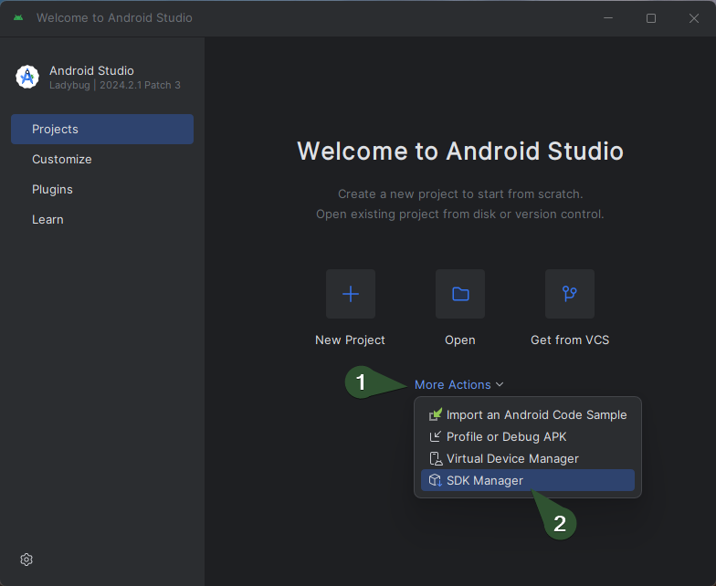
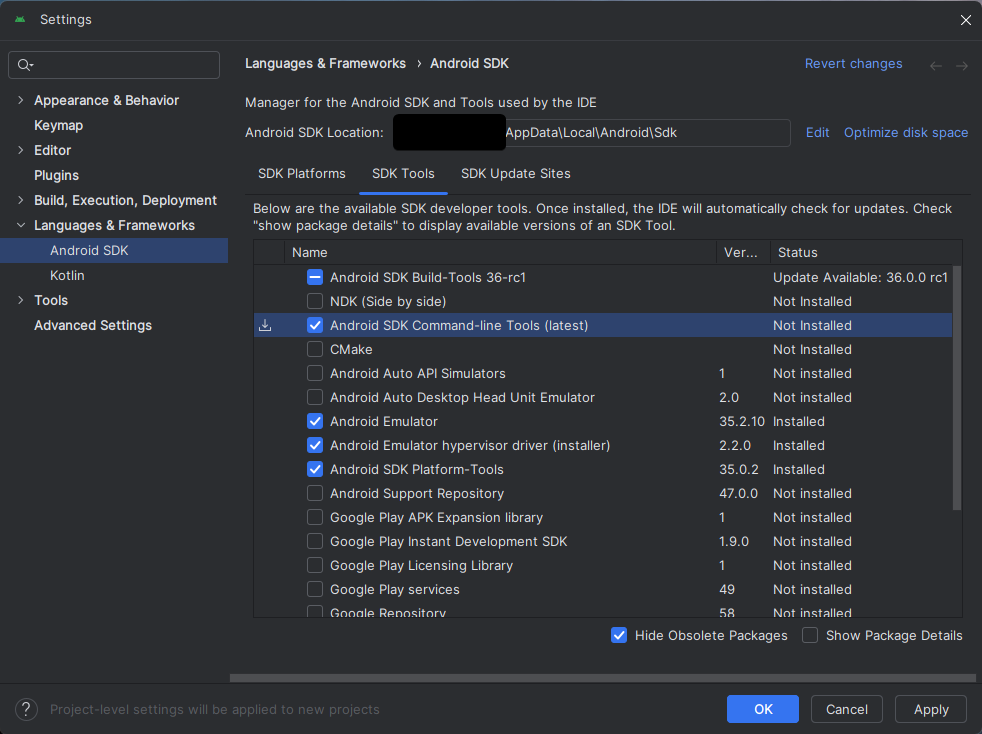

## Flutter

Používá se pro vývoj mobilních aplikací pro Android a iOS.

Využívá **Dart** jako programovací jazyk.

<details>
<summary><span style="color:#1E90FF;">Instalace</span></summary>

> [!IMPORTANT]
> Flutter používá `Git` pro správu závislostí, takže je potřeba mít nainstalovaný `Git`.

> [!IMPORTANT]
> Flutter vyžaduje nainstalovaný `Android Studio` pro vývoj aplikací pro Android.

<details>
<summary><span style="color:#E95A84;">Windows</span></summary>

1. Stáhnout Flutter SDK z [oficiálních stránek](https://flutter.dev/docs/get-started/install/windows)
2. Rozbalit ZIP soubor do složky, například: `C:\src\flutter`
   > [!IMPORTANT]
   > Cesta nesmí obsahovat mezery nebo speciální znaky
3. Přidat cestu k adresáři `flutter\bin` do proměnného prostředí `PATH`

4. Spuště nyní kontrolu zda je vše správně nastaveno:

    ```bash
    flutter doctor
    ```

5. Příkaz pro vypnutí analyzování:

    ```bash
    flutter config --no-analytics
    ```

> [!TIP]
> Pro kontrolu veškerého nastavení:
>
> ```bash
> flutter config
> ```

<details>
<summary><span style="color:#E95A84;">Android toolchain - develop for Android devices</span></summary>

1. Ujistěte se, že je nainstalován `Android Studio`
2. 
3. 

</details>

<details>
<summary><span style="color:#E95A84;">Prohlížeč pro vývoj webových aplikací</span></summary>

Pokud chcete používat jiný prohlížeč než **Google Chrome**:

```bash
flutter config --no-web-browser
```

1. Použijte

```bash
flutter run -d web-server
```

2. Otevřete ve vlastním prohlížeči a zadejte adresu `http://localhost:PORT/`

</details>

</details>
</details>

<details>
<summary><span style="color:#1E90FF;">Vytvoření nového projektu</span></summary>

```bash
flutter create project_name
```

Nyní můžete spustit aplikaci:

```bash
cd project_name
flutter run
```

</details>

<details>
<summary><span style="color:#1E90FF;">Lokalizace (interní knihovna)</span></summary>

1. Přidání závislosti do souboru `pubspec.yaml`:

   Přidejte `flutter_localizations` viz. níže:

   ```yaml
   dependencies:
   #  Internal dependencies
   flutter:
        sdk: flutter
   flutter_localizations:
        sdk: flutter
   # External dependencies
   cupertino_icons: ^1.0.8
   flutter_svg: ^2.0.16
   ```

2. Vytvořte lokalizační soubory

    - `lib/l10n/intl_en.arb`, příklad souboru pro anglické texty

         ```json
             {
               "@@locale": "en",
               "hello": "Hello",
               "welcome": "Welcome"
             }
         ```
       
    - `lib/l10n/intl_cs.arb`, příklad souboru pro české texty

         ```json
        {
            "@@locale": "cs",
            "hello": "Ahoj",
            "welcome": "Vítejte"
        }
        ```
   > [!NOTE]
   > `@@locale`, definuje jazykovou verzi překladu obsaženou v souboru `.arb`.
           
   > [!TIP]
   > Pokud chcete nastavit výchozí lokalizační soubor bez nutnosti mít `intl_messages.arb`, musíte nastavit výchozí jazyk ve vašem Flutter kódu.
   >
   > ```c++
   > // Material design for applications
   > import 'package:flutter/material.dart';
   > // Localization
   > import 'package:flutter_localizations/flutter_localizations.dart';
   > import 'generated/l10n.dart';
   >	
   > void main() {
   >    runApp(MyApp());
   > }
   >	
   >   class MyApp extends StatelessWidget {
   >   @override
   >   Widget build(BuildContext context) {
   >   		return MaterialApp(
   >   			localizationsDelegates: [
   >   				S.delegate,
   >   				GlobalMaterialLocalizations.delegate,
   >   				GlobalWidgetsLocalizations.delegate,
   >   				GlobalCupertinoLocalizations.delegate,
   >   		],
   >   		supportedLocales: S.delegate.supportedLocales,
   >   		locale: Locale('cs'), // Nastavení výchozího jazyka na češtinu
   >   		home: MainPage(),
   >   	);
   >    }
   > }
   >```

3. Vygenerovat potřebné lokalizační soubory

    Přidejte `intl_utils` do konfiguračního souboru (`pubspec.yaml`):

    ```yaml
	dependencies:
	  #  Internal dependencies
	  flutter:
		sdk: flutter
	  flutter_localizations:
		sdk: flutter
	  # External dependencies
	  intl_utils: ^2.5.0
	  cupertino_icons: ^1.0.8
	  flutter_svg: ^2.0.16
	```
   
    Spusťte následující příkaz:

    ```bash
    # Install the dependencies listed in pubspec.yaml
    dart pub get
   # Generate the necessary localization files based on the ARB files
    dart run intl_utils:generate
    ```
4. Zobrazení textu z lokalizace

    ```dart
	import 'package:flutter/material.dart'; // Import package for material design
	import 'package:flutter_localizations/flutter_localizations.dart'; // Import package for localization
	import 'generated/l10n.dart'; // Import generated localization file

	void main() {
		// Spuštění aplikace
		runApp(MyApp());
	}

	class MyApp extends StatelessWidget {
		@override
		Widget build(BuildContext context) {
			return MaterialApp(
				// Definování delegátů pro lokalizaci
				localizationsDelegates: [
					S.delegate, // Vlastní generovaný delegát pro lokalizaci
					GlobalMaterialLocalizations.delegate, // Material design lokalizace
					GlobalWidgetsLocalizations.delegate, // Widgety lokalizace
					GlobalCupertinoLocalizations.delegate, // Cupertino (iOS) lokalizace
				],
				// Podporované jazyky
				supportedLocales: S.delegate.supportedLocales,
				// Hlavní stránka aplikace
				home: MainPage(),
			);
		}
	}

	class MainPage extends StatelessWidget {
		@override
		Widget build(BuildContext context) {
			return Scaffold(
				appBar: AppBar(
					// Zobrazení lokalizovaného textu v AppBar
					title: Text(S.of(context).hello),
				),
				body: Center(
					// Zobrazení lokalizovaného textu v těle stránky
					child: Text(S.of(context).welcome),
				),
			);
		}
	}
    ```
   

</details>