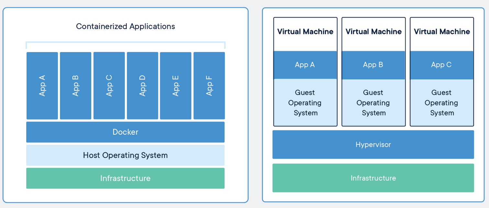

Izoluje aplikace se všemi jejími knihovnami, konfiguračními soubory a dalšími závislými soubory do kontejnerů.

> [!NOTE]
> Kontejnery zajišťují, že aplikace mohou být spuštěny v jakémkoli prostředí.

Docker se stará o celý životní cyklus kontejnerů.

**Kontejner** ➜ **Vytvoření** ➜ **Spuštění** ➜ **Zastavení**

> [!TIP]
> - Kontejnerizace je virtualizací jádra operačního systému. 
> 
> 	Všechny kontejnery běží v rámci jednoho operačního systému a sdílejí paměť, knihovny a další zdroje.
> 
> - Zdroje se tímto způsobem využívají efektivnější než klasická virtualizace.
> 
> 	Spuštění kontejneru je navíc mnohem rychlejší než spuštění virtuálního stroje s instalací operačního systému.
> 
> - Malá režie a na stejném hardwaru můžete spustit více docker kontejnerů než virtuálních strojů
> 
> 

## Soubory dockeru

### dockerd.exe a docker.exe

- dockerd.exe:

  Spouští Docker Daemon, což je hlavní služba, která spravuje kontejnery a poslouchá na socketu či TCP portu.

- docker.exe

  Klientský nástroj, který posílá příkazy daemonu (např. `docker run`, `docker ps`).

### docker-compose.exe a docker-compose.yml

- docker-compose.exe:
  
    Umožňuje definovat a spouštět více Docker kontejnerů jako součásti jedné aplikace. 
    
    Pomocí souboru `docker-compose.yml` můžete definovat všechny služby (kontejnery), které mají běžet, včetně jejich konfigurací, závislostí a propojení mezi nimi.

- docker-compose.yml:

    Konfigurační soubor, který popisuje, jaké kontejnery (služby) mají být spuštěny, jaké obrazové soubory mají používat, jaké porty mají být mapovány a jaké další nastavení kontejnery potřebují. 
    
    Tento soubor je zpracován příkazem `docker-compose up`, který automaticky spustí všechny definované kontejnery.

## Základní pojmy

### dockerfile

Textový soubor s instrukcemi k vytvoření `Docker image`. 

Specifikuje operační systém, na kterém bude běžet kontejner, jazyky, lokace, porty a další komponenty.

### docker image

Komprimovaná, samostatná část softwaru vytvořená příkazy v `Dockerfile`. 

Je to "šablona" (aplikace plus požadované knihovny a binární soubory) potřebná k vytvoření a spuštění Docker kontejneru.

### docker run

Příkaz, který spouští kontejnery. 

> [!NOTE]
> Každý kontejner je instancí jednoho image.

### docker hub

  Oficiální úložiště pro sdílení `docker image`.

> [!TIP]
> Obsahuje officiální `docker image` z open-source projektů a neoficiální od komunity.
>
> Možnost pracovat i s lokálními docker úložišti.

### docker engine

  Jádro softwaru docker. 
 
  Technologie na principu klient-server, která vytváří a provozuje kontejnery.

### docker compose

  Definice ke spuštění více kontejnerů.

## Příkazy

### Stáhnout docker image
    
```Docker
docker pull <Image name>
```

> [!NOTE]
> <Image name>
> 
> Je název `docker image`.
> 
> Například: `mcr.microsoft.com/dotnet/core/sdk:3.1`

Umístění docker image po stažení:

- Linux:
  
    ```Bash
    /var/lib/docker/
    ```

- Windows:

    ```Bash
    C:\ProgramData\DockerDesktop
    ```

- macOS:

    ```Bash
    ~/Library/Containers/com.docker.docker/Data/vms/0/
    ```

### Sestavení docker image

- `docker build [-t] customFolder`

  Sestaví kontejner pro docker image ve vybraném adresáři.

    > [!NOTE]
    > `customFolder`
    >
    >  Název vybraného adresáře k sestavení docker image.
    >
    > Může být například aktuální adresář: `.`, nebo jakkoli jinak.
    >
    > `-t`
    > 
    >  Pojmenování image a tagu. (Pokud není zadán parametr -t, použije se tag: `latest`)
    
- Příklad:
  
  ```Docker
  docker build -t myapp .
  ```

    > [!TIP]  
    > `myapp`
    >
    > Název pro nově sestavený kontejner. (Může být jakýkoli.)
    > 
    > `.`
    >
    > Pracovní adresář v dockeru. (V tomto příkladu kořenový adresář.)

### Spuštění kontejneru z docker image

- `docker run <docker image>`

  Spustí kontejner pro docker image.

  ```Docker
  docker run kitematic/hello-world-nginx
  ```

    > [!TIP]  
    > Spustí docker kontejner s docker image: `kitematic/hello-world-nginx`

### Spustit na jiném portu

```Docker
docker run -p 70:80 kitematic/hello-world-nginx 
```
	
> [!NOTE]  
> `-p`
>
> Mapuje port 70 na hostitelském stroji na port 80 uvnitř kontejneru. (To znamená, že pokud aplikace uvnitř kontejneru poslouchá na portu 80, bude přístupná na portu 70 hostitelského stroje.)
>
> `kitematic/hello-world-nginx`
>
> Název docker image ke spuštění.

### Spustit v interaktivním módu

```Docker
docker run -it kitematic/hello-world-nginx 
```

> [!NOTE]
>  Užitečné, pokud chcete spustit kontejner a poté v něm spustit další příkazy, například při ladění nebo vývoji.

### Odstranit po zastavení

```Docker
docker run --rm kitematic/hello-world-nginx 
```

> [!NOTE]  
> `--rm`
>
> Docker automaticky odstraní kontejner, když je běh kontejneru přerušení.

> [!TIP]  
> Užitečné, pokud nechcete, aby se vaše lokální úložiště naplnilo zastavenými kontejnery.

### Spuštění více kontejnerů z docker image najednou

> [!NOTE]
> Musíte použít soubor YAML k definování služeb vaší aplikace.
> 
> Následně pomocí jediného příkazu `docker-compose up` můžete vytvořit a spustit všechny služby definované ve vašem souboru `docker-compose.yml`.

> [!TIP]
> Automaticky použije lokální `docker image`, pokud je k dispozici.

Příklad souboru `docker-compose.yaml`:

```yaml
# Verze Docker Compose souboru
version: '3.4'

# Definice služeb
services:
  # Název služby
  webapp:
    # Obraz, který se má použít pro tuto službu
    # Tento obraz je vzorová aplikace ASP.NET Core od Microsoftu
    image: mcr.microsoft.com/dotnet/core/samples:aspnetapp
    # Instrukce pro sestavení obrazu
    build:
      # Kontext pro sestavení, obvykle je to adresář obsahující Dockerfile
      context: .
      # Cesta k Dockerfile
      dockerfile: Dockerfile
    # Mapování portů mezi hostitelem a kontejnerem
    # Formát je "host:kontejner"
    # Toto nastavení říká Dockeru, aby přesměroval port 8000 na hostiteli na port 80 v kontejneru
    ports:
      - "8000:80"
```

## Dockerfile

V dockeru **není žádná výchozí složka**.

> [!TIP]
> Když vytváříte Dockerfile, můžete nastavit pracovní adresář v kontejneru pomocí příkazu `WORKDIR`.

> [!TIP]
> Pokud není nastaven `WORKDIR`, vztahuje se vše na kořenový adresář (/) kontejneru.

### Příklad pro .NET Core

```Docker
# Používáme oficiální .NET Core runtime image z Docker Hub
# 'dotnet' je jméno image a '3.1' je tag, který specifikuje verzi
FROM mcr.microsoft.com/dotnet/core/runtime:3.1

# Nastavíme pracovní adresář v kontejneru na /app
# Pokud tento adresář neexistuje, docker ho vytvoří
WORKDIR /app

# Kopírujeme výstup buildu z našeho stroje do kontejneru
# 'publish' je cesta k výstupu buildu na našem stroji
# '.' znamená aktuální (pracovní) adresář v kontejneru
COPY ./publish .

# Nastavíme spustitelný soubor pro kontejner
# 'myapp.dll' je název naší aplikace
ENTRYPOINT ["dotnet", "myapp.dll"]
```

> [!NOTE]
> Vytvoří `docker image` pro vaši aplikaci .NET Core. 
> 
> Když spustíte kontejner z této image, vaše aplikace se automaticky spustí. 

### Příklad pro C# Aplikaci

```Docker
# Používáme oficiální .NET Core SDK image z Docker Hub
# 'dotnet' je jméno image a '3.1' je tag, který specifikuje verzi
FROM mcr.microsoft.com/dotnet/core/sdk:3.1

# Nastavíme pracovní adresář v kontejneru na /app
# Pokud tento adresář neexistuje, docker ho vytvoří
WORKDIR /app

# Kopírujeme všechny soubory z našeho stroje do kontejneru
# '.' znamená aktuální adresář na našem stroji
# '.' znamená aktuální (pracovní) adresář v kontejneru
COPY . .

# Spustíme příkaz 'dotnet restore', který stáhne všechny potřebné NuGet balíčky
RUN dotnet restore

# Spustíme příkaz 'dotnet publish', který vytvoří výstup buildu naší aplikace
RUN dotnet publish -c Release -o out

# Nastavíme spustitelný soubor pro kontejner
# 'myapp.dll' je název naší aplikace
ENTRYPOINT ["dotnet", "out/myapp.dll"]
```

> [!NOTE]
> Tento Dockerfile vytvoří docker image pro vaši aplikaci C#. 
>
> Když spustíte kontejner z této image, vaše aplikace se automaticky spustí.

### Příklad .NET Core a lokálních NuGet balíčků

```Docker
# Používáme oficiální .NET Core SDK image z Docker Hub
FROM mcr.microsoft.com/dotnet/core/sdk:3.1

# Nastavíme pracovní adresář v kontejneru na /app
WORKDIR /app

# Kopírujeme všechny soubory z našeho stroje do kontejneru
COPY . .

# Spustíme příkaz 'dotnet restore', který načte všechny potřebné NuGet balíčky z lokálního úložiště
# Předpokládáme, že všechny potřebné NuGet balíčky jsou uloženy v adresáři 'nuget' našeho projektu
RUN dotnet restore --source ./nuget

# Spustíme příkaz 'dotnet publish', který vytvoří výstup buildu naší aplikace
RUN dotnet publish -c Release -o out

# Nastavíme spustitelný soubor pro kontejner
ENTRYPOINT ["dotnet", "out/myapp.dll"]
```

> [!TIP]
> V tomto příkladu předpokládáme, že všechny potřebné NuGet balíčky jsou uloženy v adresáři `nuget` vašeho projektu. 
> 
> Příkaz `dotnet restore --source ./nuget` pak načte tyto balíčky z lokálního úložiště místo stahování z internetu.

## Zachování dat z kontejneru na lokálním disku

